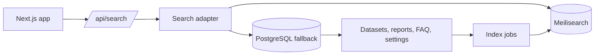

# Meilisearch Integration Plan

Planning-only document. Use this when activating Meilisearch work for dashboard search, FAQ search,
dataset/report discovery, and future docs-subdomain power search.

## Goal

Add Meilisearch as a fast indexed search layer while keeping PostgreSQL and application access rules as the source of truth.

Meilisearch should improve:

- Dashboard search popup results.
- Public and dashboard FAQ discovery.
- Dataset and report discovery.
- Future CMS/content search.
- Future docs-subdomain public documentation search.
- Future docs-subdomain protected operator documentation search.
- Super-admin operational search where allowed.

## Current Search State

- Dashboard search route uses `src/lib/search/app-search.ts`.
- Static page results are stored in `APP_PAGES`.
- Public FAQ content comes from `src/lib/content/faq.ts`.
- Dashboard and operator FAQ content comes from `src/lib/content/dashboard-faq.ts`.
- Dataset search uses PostgreSQL `ilike` against dataset name and file name.
- Dataset row search scans a limited set of JSON row data after matching datasets.
- Report search reads generated report metadata from report storage and checks dataset ownership.
- Docs subdomain search does not exist yet.
- Search access scope is enforced in application code:
  - Signed-in users see own datasets and own reports.
  - Super-admin users see platform-wide operational results.
  - Operator FAQ content is super-admin only.

## Non-Goals

- Do not replace PostgreSQL as source of truth.
- Do not index secrets, raw environment values, private keys, payment data, or full sensitive uploaded files.
- Do not expose user-owned results without application-side access filters.
- Do not make Meilisearch required for core dashboard use until fallback behavior is proven.
- Do not bypass existing role checks for public, signed-in, and super-admin users.
- Do not expose operator docs or protected docs metadata in public search indexes.

## Target Architecture



## Environment Variables

Add only when implementation starts:

- `MEILISEARCH_HOST`
- `MEILISEARCH_SEARCH_KEY`
- `MEILISEARCH_ADMIN_KEY`
- `MEILISEARCH_ENABLED`
- `MEILISEARCH_INDEX_PREFIX`

Rules:

- Use search key for query-time reads.
- Use admin key only in server-side indexing jobs.
- Never expose admin key to client components.
- Keep local development disabled by default unless a local Meilisearch service is running.

## Index Plan

### `app_pages`

Purpose: Fast navigation search for known dashboard pages.

Fields:

- `id`
- `type`
- `title`
- `description`
- `href`
- `keywords`
- `roles`

Filters:

- `roles`

### `faq_items`

Purpose: Public, dashboard, and operator FAQ search.

Fields:

- `id`
- `scope`: `public`, `dashboard`, `operator`
- `category`
- `question`
- `answer`
- `href`
- `tags`

Filters:

- `scope`

Access:

- Public search uses only `public`.
- Dashboard search uses `public` and `dashboard`.
- Super-admin search uses `public`, `dashboard`, and `operator`.

### `datasets`

Purpose: Search dataset names, filenames, status, and safe metadata.

Fields:

- `id`
- `userId`
- `type`
- `name`
- `fileName`
- `analysisStatus`
- `columnNames`
- `createdAt`
- `updatedAt`
- `href`

Filters:

- `userId`
- `analysisStatus`

Access:

- Signed-in users query with `userId = session.user.id`.
- Super-admin may omit `userId` filter only in super-admin search contexts.

### `dataset_rows`

Purpose: Optional limited row-content search for datasets.

Fields:

- `id`
- `datasetId`
- `userId`
- `safePreviewText`
- `rowIndex`
- `href`

Filters:

- `userId`
- `datasetId`

Rules:

- Index only safe, truncated preview text.
- Do not index full uploaded datasets by default.
- Make row indexing opt-in or limited per dataset.

### `reports`

Purpose: Search generated report metadata.

Fields:

- `id`
- `datasetId`
- `userId`
- `datasetName`
- `summary`
- `findings`
- `visibility`
- `createdAt`
- `href`

Filters:

- `userId`
- `visibility`
- `datasetId`

Access:

- Signed-in users query own private reports and any public report allowed by app rules.
- Super-admin may query all reports in operational contexts.

### Future `content_pages`

Purpose: Search Payload/CMS-managed public content after CMS integration exists.

Fields:

- `id`
- `slug`
- `title`
- `summary`
- `body`
- `status`
- `audience`
- `updatedAt`
- `href`

Filters:

- `status`
- `audience`

Rules:

- Index published content only for public search.
- Keep draft content admin-only.

### Future `docs_public`

Purpose: Search the public docs subdomain.

Fields:

- `id`
- `slug`
- `section`
- `title`
- `summary`
- `body`
- `tags`
- `href`
- `visibility`: `public`

Filters:

- `section`
- `visibility`

Rules:

- Index only docs approved for the public docs host.
- Keep results usable without leaking hidden content structure.

### Future `docs_operator`

Purpose: Search protected operator docs on the docs subdomain.

Fields:

- `id`
- `slug`
- `section`
- `title`
- `summary`
- `body`
- `tags`
- `href`
- `visibility`: `operator`
- `roles`

Filters:

- `visibility`
- `roles`
- `section`

Rules:

- Query only after superadmin auth succeeds.
- Keep the operator index physically or logically separated from the public docs index.
- Never return operator snippets or titles in public search responses.

## Implementation Phases

### Phase 1: Adapter And Fallback

- Add `src/lib/search/search-adapter.ts`.
- Keep current `searchApp()` as fallback.
- Add `MEILISEARCH_ENABLED` gate.
- Add timeout and error fallback to current PostgreSQL/static search.
- Return the same `AppSearchResult` shape used by the current search popup.

### Phase 2: FAQ And Page Indexing

- Add a server-side indexing script for static `APP_PAGES`, public FAQ, dashboard FAQ, and operator FAQ.
- Add npm/pnpm script such as `search:index:static`.
- Add filters for `scope` and `roles`.
- Update `/api/search` to use Meilisearch for FAQ/page search when enabled.
- Keep current static search fallback.

### Phase 3: Dataset Metadata Indexing

- Index dataset metadata after upload, rename, status update, and delete.
- Add reindex script for existing datasets.
- Filter by `userId` for regular users.
- Keep database ownership checks before returning dataset links.

### Phase 4: Report Metadata Indexing

- Index generated report metadata when reports are created, visibility changes, or reports are deleted.
- Filter by `userId`, `visibility`, and dataset ownership.
- Keep PostgreSQL/report-store validation before returning private report results.

### Phase 5: Optional Row Preview Indexing

- Add opt-in, truncated row preview indexing.
- Add size limits and field allowlist.
- Avoid indexing sensitive columns.
- Provide delete/reindex behavior when datasets are removed.

### Phase 6: Operations And Monitoring

- Add healthcheck for Meilisearch connectivity when enabled.
- Add admin-only reindex action or script.
- Log index failures without blocking upload or report generation.
- Add docs for local and Railway/host setup.

### Phase 7: Docs Subdomain Search

- Add a docs search adapter for `docs.useclevr.com`.
- Index public docs content into `docs_public`.
- Add protected operator docs indexing into `docs_operator`.
- Add auth-aware filters before operator-doc search runs.
- Keep public docs search available without login.
- Keep baseline docs navigation usable when Meilisearch is disabled.

## Access Control Rules

- Apply filters in Meilisearch query.
- Recheck access in application code before returning results.
- Never rely only on Meilisearch filters for private data.
- Public routes search public content only.
- Dashboard routes require auth.
- Super-admin filters are explicit and route-controlled.

## Deployment Notes

- Railway app should not assume Meilisearch is available unless `MEILISEARCH_ENABLED=true`.
- Meilisearch can run as a separate service or external managed search service.
- Store Meilisearch keys in host environment variables only.
- Keep generated `dist/` packaging working without Meilisearch installed locally.
- Search indexing scripts must be server-side and not bundled into client components.

## Validation

- `pnpm validate:types`
- `pnpm validate:dist`
- `pnpm lint`
- Search route smoke test with Meilisearch disabled.
- Search route smoke test with Meilisearch enabled.
- Access tests for user-owned dataset/report results.
- Super-admin search test for operator FAQ and platform-wide operational results.

## Acceptance Criteria

- Dashboard search returns the same result shape with or without Meilisearch.
- Meilisearch disabled mode keeps current search working.
- Public search never returns dashboard/operator/private content.
- Signed-in user search returns only own dataset/report results.
- Super-admin search returns operator and platform-wide results only in super-admin context.
- Dataset/report deletion removes or hides indexed records.
- Indexing failure does not block upload, report creation, or page rendering.

## Prompt For AI Implementation

```text
Add Meilisearch as an optional indexed search layer for UseClevr.

Keep PostgreSQL and current app data as the source of truth.
Keep current search behavior as fallback when Meilisearch is disabled or unavailable.
Return the existing AppSearchResult shape.

Start with page and FAQ indexes, then dataset metadata, then report metadata.
Do not index full uploaded datasets by default.
Do not expose secrets, payment data, private keys, or raw sensitive files.
Apply Meilisearch filters and recheck access in application code.

Respect scopes:
- public users see public FAQ/content only
- dashboard users see public + dashboard FAQ and own datasets/reports
- superadmin users see public + dashboard + operator FAQ and platform-wide operational results

Add docs, env var guidance, indexing scripts, fallback behavior, and validation checks.
```
