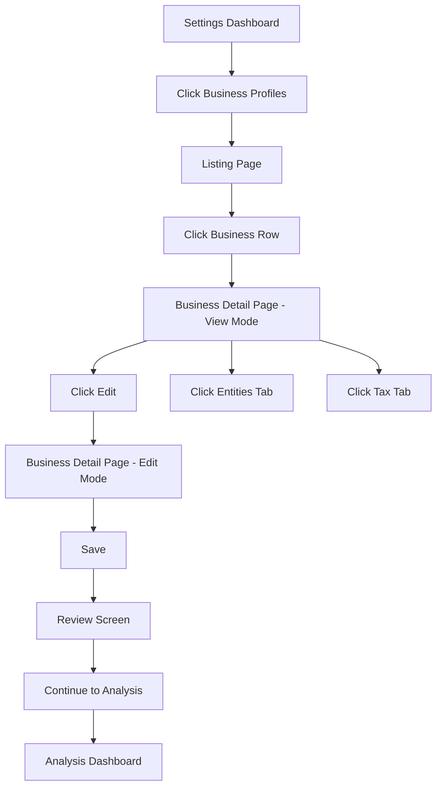
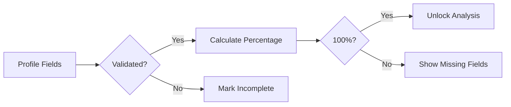
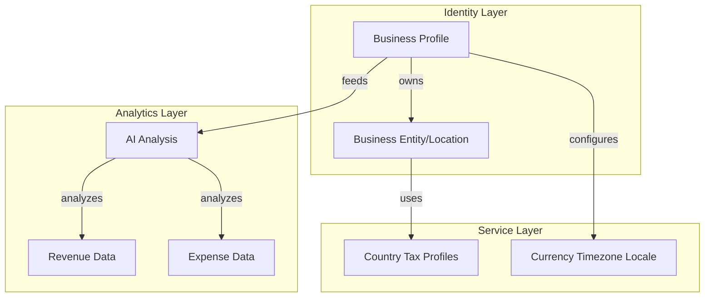
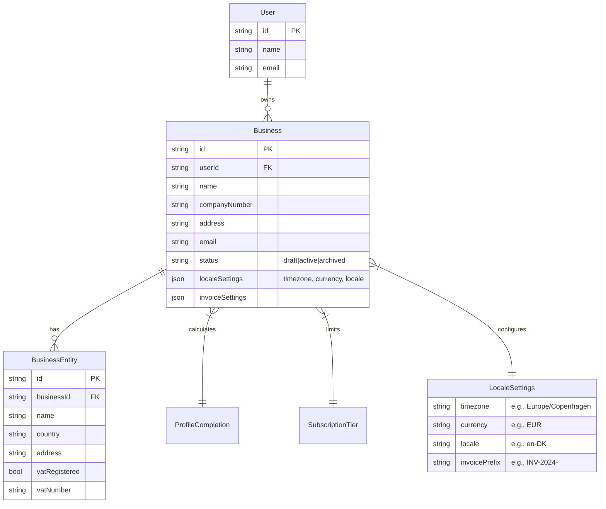

# Business Profile Settings Implementation Plan

## Table of Contents
- [S1: User Experience Flow](#s1-user-experience-flow)
- [S2: Business Architecture](#s2-business-architecture)
- [S3: Data Model Design](#s3-data-model-design)
- [S4: Development Implementation](#s4-development-implementation)
  - [S4.1 Data Model Changes](#s41-data-model-changes)
  - [S4.2 Business Profile Listing Page](#s42-business-profile-listing-page)
  - [S4.3 Individual Business Profile Page](#s43-individual-business-profile-page)
  - [S4.4 Business Operations](#s44-business-operations)
  - [S4.5 Tax & Accountancy Details](#s45-tax--accountancy-details)
  - [S4.6 Review & Validation Screen](#s46-review--validation-screen)
- [S5: User Flows & Navigation](#s5-user-flows--navigation)

---

## S1: User Experience Flow

### L1 Dashboard Navigation Flow


### L2 Profile Completion Engine Flow


---

## S2: Business Architecture

### L1 Business Model Layers


### L2 Multi-Business Requirements
- Each user can manage multiple businesses based on subscription/plan capability
- Business limit driven by subscription tier, not hardcoded
- Each business has: profile (identity), operations (locations), tax profiles (intelligence)
- Archive flow: soft-delete → 3 month grace period → (V1: no permanent delete)

### L3 Status Flow


---

## S3: Data Model Design

### L1 Entity Relationship

#### Business Profile Schema


#### Tax Intelligence Layer (Cached)
```mermaid
erDiagram
    Country ||--|| CountryTaxProfile : defines

    Country {
        string code PK "e.g., DK, UK, US-NY"
        string name
    }

    CountryTaxProfile {
        string countryCode PK FK
        json vatRates
        json corporateTaxRates
        json filingDeadlines
        json requirements
        timestamp lastUpdated
        timestamp cachedAt
    }
```

---

## S4: Development Implementation

---

### S4.1 Data Model Changes
Database schema updates for multi-business support.

#### T4.1.1 Business Table
- [ ] Create `Business` table with fields: id, userId, name, companyNumber, address, email, status (draft|active|archived)
- [ ] Add localeSettings JSON: timezone, currency, locale, invoicePrefix
- [ ] Add invoiceSettings JSON
- [ ] Foreign key to User table

#### T4.1.2 BusinessEntity Table (renamed from Operation)
- [ ] Create `BusinessEntity` table with fields: id, businessId, name, country, address
- [ ] Add tax fields: vatRegistered (bool), vatNumber
- [ ] One-to-many relationship to Business

#### T4.1.3 CountryTaxProfile Table (cached service)
- [ ] Create `CountryTaxProfile` table with fields: countryCode, vatRates, taxRates, deadlines, metadata
- [ ] 7-day cache for auto-loaded tax data
- [ ] Separate from operation rows for cleaner architecture

#### T4.1.4 Profile Completion Engine
- [ ] Create reusable profile completion engine (not business-specific)
- [ ] Track completion percentage per business
- [ ] Unlock features at 100% completion

---

### S4.2 Business Profile Listing Page
Main dashboard page listing all businesses for a user.

#### T4.2.1 Page Layout
- [ ] Create `/settings/businesses/page.tsx`
- [ ] List businesses in row format (similar to customer rows pattern)
- [ ] Show business name, location, entity count, completion status

#### T4.2.2 Subscription-Based Limit Enforcement
- [ ] Add to User/Subscription context: maxBusinesses (from plan tier)
- [ ] Disable "Add Business" button when limit reached
- [ ] Show upgrade prompt when limit reached

#### T4.2.3 Row Actions
- [ ] View button - navigate to business detail page
- [ ] Archive button - opens confirmation modal with type-in-name validation
- [ ] Archive = soft delete (V1: no permanent deletion)

---

### S4.3 Individual Business Profile Page
Dynamic page for each business with view and edit modes.

#### T4.3.1 View/Edit Toggle
- [ ] Default to view mode
- [ ] Edit button switches to edit mode
- [ ] Save/Cancel buttons in edit mode

#### T4.3.2 Company Official Details Section
- [ ] Company name and number
- [ ] Company address (multi-line)
- [ ] Company email and phone
- [ ] Website URL
- [ ] Business description

#### T4.3.3 Locale & Invoice Settings
- [ ] Timezone selector
- [ ] Default currency selection
- [ ] Locale selector
- [ ] Invoice numbering preference

#### T4.3.4 Account Yearly Rolling Setting
- [ ] Tax year start/end dates
- [ ] Fiscal year configuration

---

### S4.4 Business Operations (BusinessEntity)
Operations for each business with country-specific tax details.

#### T4.4.1 Entities List
- [ ] List all entities for a business
- [ ] Each entity shows: country, address, VAT registered status

#### T4.4.2 Tax Details Panel (from CountryTaxProfile)
- [ ] Read-only display of cached tax details
- [ ] Cached for 7 days
- [ ] Shows: currency, tax % rates, filing deadlines

#### T4.4.3 Country-Based Auto-Tax Loading
- [ ] Map entity address to country
- [ ] Load country-specific tax defaults from CountryTaxProfile
- [ ] Manual override option

---

### S4.5 Tax & Accountancy Details
Preferences and settings for bookkeeping and accounting.

#### T4.5.1 Prerequisites
- [ ] Tax preferences only available after at least one entity exists

#### T4.5.2 Book/Accountancy Details
- [ ] Currency selection (already in locale settings)
- [ ] Tax dates configuration
- [ ] Reporting preferences

#### T4.5.3 Financial Overview (V1 Manual)
- [ ] Total Revenue (manual entry in V1)
- [ ] Total Expenses breakdown:
  - [ ] Insurance
  - [ ] Loans & Leasing
- [ ] Future: connect to CSV/AI analysis automatically

---

### S4.6 Review & Validation Screen
Final review before completing business setup.

#### T4.6.1 Setup Accuracy
- [ ] Calculate completion percentage (from ProfileCompletion engine)
- [ ] Show completed sections count
- [ ] Highlight missing fields

#### T4.6.2 Accountant Review Flags
- [ ] Loan principal repayment = not normal expense (flag unknown treatment)
- [ ] Loan interest = expense
- [ ] Credit card repayment should not duplicate underlying expenses (flag potential duplicates)
- [ ] Leasing requires accountant review if treatment is unknown
- [ ] Insurance may need business/private percentage split
- [ ] Tax settings flagged if estimated/uncertain

#### T4.6.3 Review Display
- [ ] Setup Accuracy % prominently displayed
- [ ] Collapsible JSON preview (admin/dev only)
- [ ] Save Company Setup button
- [ ] Continue to Analysis button

---

## S5: User Flows & Navigation

### L1 Navigation Flow Steps
1. User accesses Settings → Business Profiles
2. Lands on listing page showing all businesses
3. Each business row links to `/settings/businesses/[id]`
4. Business detail page shows view mode by default
5. Edit mode reveals all form fields
6. Final step: Review screen before completing setup

### L2 Archive Flow Steps
- [ ] Click archive triggers confirmation dialog
- [ ] User must type business name to confirm
- [ ] Business moves to archived state
- [ ] 3-month grace period for recovery (V1: no automatic deletion)

### L3 Update Guides
- [ ] Update user guide documentation
- [ ] Update developer documentation for new schema

---

[ADDITIONAL]

# Optimized Business Profile & Tax Intelligence Plan

## Core Architecture Principle

```text
Business Profile = Identity & Configuration Layer
Tax Intelligence = Separate Cached Service Layer
AI Analysis = Separate Analytics Layer
Accounting = Separate Financial Layer
```

Avoid building one giant business-management system early. Keep modules separated and composable.

---

# 1. Optimized User Flow

## Previous Flow

```text
Businesses List
→ Business Detail
→ Edit Mode
→ Operations
→ Tax Settings
→ Review
→ Save
```

## Optimized Condensed Flow

```text
Business List
→ Business Workspace
   ├── Overview
   ├── Locations & Operations
   ├── Tax & Accounting
   ├── Financial Setup
   └── Review & Accuracy
```

Instead of multiple isolated pages/modals, use:

* single workspace layout
* left sidebar navigation OR top tabs
* autosave where possible
* inline editing instead of separate edit mode

This reduces navigation fatigue.

---

# 2. Recommended UI Structure

## Business Workspace Layout

### Left Sidebar

```text
[Company Logo]
Business Name
Completion %

• Overview
• Operations & Countries
• Tax & VAT
• Financial Settings
• Accounting Flags
• Review & Validation
```

### Main Content Area

* section cards
* collapsible groups
* progressive disclosure
* validation indicators

---

# 3. Flowchart Optimization

Instead of dots between steps:

```text
● → ● → ●
```

Use connected progress lines:

```text
Overview ━━━ Operations ━━━ Tax ━━━ Financials ━━━ Review
```

Benefits:

* clearer progression
* more enterprise feel
* easier to understand current position
* visually cleaner

Recommended:

* active step highlighted
* completion checkmarks
* warning icons for missing critical data

---

# 4. Additional Important Sections

## 4.1 Compliance & Legal

Add lightweight legal section:

* VAT registered
* EU OSS/IOSS
* Business type
* Tax residency
* Employee count
* Industry category

This becomes important later for AI-driven accounting interpretation.

---

## 4.2 AI Confidence & Accuracy Layer

Strong differentiator for UseClevr.

### Example

```text
AI Setup Confidence: 87%

Warnings:
- Loan repayment may not be deductible
- VAT setup incomplete
- Insurance classification uncertain
```

This gives:

* enterprise trust
* transparency
* accountant-friendly workflow
* AI reliability scoring

---

## 4.3 Smart Recommendations

AI assistant should proactively suggest:

* missing VAT setup
* duplicated expenses
* currency mismatches
* unusual reporting periods
* missing tax dates
* insurance inconsistencies

This is a strong innovation opportunity.

---

## 4.4 Country Tax Intelligence Layer

Do not hardcode tax logic into business rows.

Recommended architecture:

```text
CountryTaxProfile
├── countryCode
├── VAT defaults
├── filing schedules
├── deductible categories
├── reporting requirements
└── cache expiration
```

Business only references:

```text
countryTaxProfileId
```

This avoids duplicated tax logic.

---

# 5. Data Model Optimizations

## Business Table

Recommended additions:

```text
status: draft | active | archived
locale
timezone
defaultCurrency
industry
businessType
vatRegistered
vatNumber
completionScore
aiConfidenceScore
```

---

## Operations Table

Rename suggestion:

```text
BusinessLocation
```

More user friendly than:

```text
BusinessOperation
```

Suggested fields:

```text
country
currency
taxSystem
vatApplicable
employeeCount
address
```

---

# 6. Review Screen Optimization

Current review idea is strong.

Improve with:

## Split Review Areas

### Business Identity

* company data
* registration
* address

### Tax Setup

* VAT
* filing periods
* regional requirements

### Financial Structure

* loans
* leasing
* insurance
* recurring expenses

### AI Risk Flags

* uncertain entries
* duplicate risks
* missing documents

---

# 7. UX Optimization Recommendations

## Recommended

### Inline Editing

Avoid:

```text
View Mode → Edit Mode
```

Use:

```text
click field → edit inline
```

Much faster.

---

## Autosave

Avoid manual save after every section.

Use:

```text
Saving...
Saved ✓
```

---

## Sticky Progress Header

Always show:

```text
Business Name
Completion %
AI Confidence %
Missing Critical Items
```

---

# 8. Important Future-Proofing

## Keep Business Profile Separate From:

* CSV ingestion
* AI analysis engine
* accounting exports
* report generation
* forecasting engine

Only connect through IDs/services.

This prevents massive future refactors.

---

# 9. Recommended MVP Scope

## V1 Should Include

### Core

* business profiles
* locations
* tax setup
* review screen
* AI validation flags
* completion score

### NOT V1

* permanent delete workers
* advanced automation
* accounting integrations
* invoice systems
* live government APIs
* complex role systems

Keep V1 lean and stable.

---

# 10. Strategic Product Differentiators

Potentially unique features:

```text
AI Setup Confidence
AI Accountant Flags
Country Tax Intelligence
Business Health Validation
Financial Consistency Checks
```

Most AI BI tools do not deeply validate accounting/tax/business setup consistency.

This can become a strong enterprise positioning advantage for UseClevr.

[additional]

IMPORTANT UPDATE: Connect the Company Setup Wizard to the existing UseClevr calculation logic.

The Company Setup Wizard must not be only a standalone form.
Its output must become a reusable "Company Calculation Context" that is used by the existing analysis engine, KPI calculations, profit/loss logic, cashflow logic, tax estimates, insurance treatment, loan/leasing handling and accountant review flags.

Goal:
When the user uploads CSV/business data, the existing analysis logic should use the saved company setup to calculate more accurately.

Do not replace the existing calculation engine.
Do not rewrite the current analysis pipeline.
Use the smallest possible change.
Add a clean context layer that can be passed into the existing calculation functions.

Required concept:

Create a structured object called:

companyCalculationContext

It should be generated from the Company Setup Wizard payload.

Example structure:

{
  "company": {
    "countryOfRegistration": "",
    "taxResidenceCountry": "",
    "legalStructure": "",
    "industry": "",
    "accountingMethod": "",
    "primaryCurrency": "",
    "reportingCurrency": ""
  },
  "tax": {
    "taxRegistered": "",
    "taxType": "",
    "standardTaxRate": "",
    "revenueAmountType": "",
    "expenseAmountType": "",
    "estimateTaxes": ""
  },
  "revenue": {
    "revenueSources": [],
    "customerType": "",
    "invoiceOrPaymentBased": "",
    "paymentProviders": [],
    "hasRefundsOrChargebacks": ""
  },
  "expenses": {
    "expenseCategories": [],
    "hasMixedBusinessPrivateExpenses": "",
    "receiptsAvailable": "",
    "hasRecurringExpenses": ""
  },
  "insurance": {
    "hasBusinessInsurance": "",
    "insuranceTypes": [],
    "insurancePremiumAmount": "",
    "insurancePaymentFrequency": "",
    "insuranceBusinessUsePercentage": ""
  },
  "liabilities": {
    "hasBusinessLoans": "",
    "hasLeasing": "",
    "hasCreditCards": "",
    "hasOverdraft": "",
    "monthlyDebtPayment": "",
    "loanInterestKnown": "",
    "principalInterestSplitKnown": ""
  },
  "setupStatus": {
    "setupAccuracy": 0,
    "missingFields": [],
    "accountantReviewFlags": []
  }
}

How this context must affect calculations:

1. Currency logic
- Use reportingCurrency as the default currency for reports.
- Use primaryCurrency as the business base currency.
- If uploaded CSV contains another currency and no exchange rate exists, flag:
  "FX conversion needs review"
- Do not silently mix currencies.

2. Tax logic
- If revenueAmountType is "Gross, tax included", calculate estimated net revenue by removing tax using standardTaxRate.
- If revenueAmountType is "Net, tax excluded", keep revenue as net and estimate tax separately if estimateTaxes is Yes.
- If revenueAmountType is "Mixed" or "Not sure", do not force tax calculation. Mark tax confidence as Medium/Low and create accountant review flag.
- If taxRegistered is No, do not calculate VAT/GST/Sales Tax unless explicitly requested.
- If taxRegistered is Not sure, show business profit before tax and flag tax review.

3. Expense logic
- If expenseAmountType is "Gross, tax included", separate estimated tax portion if standardTaxRate exists.
- If expenseAmountType is "Net, tax excluded", treat amount as net expense.
- If expenseAmountType is Mixed or Not sure, mark expense confidence as Medium/Low.
- If hasMixedBusinessPrivateExpenses is Yes or Not sure, flag possible private/business expense review.

4. Revenue recognition
- If accountingMethod is "Cash basis", prioritize payment date when available.
- If accountingMethod is "Accrual basis", prioritize invoice date or service/sale date when available.
- If accountingMethod is "Not sure", keep existing default calculation but flag accounting method review.
- Do not break existing revenue total logic.

5. Insurance logic
- If hasBusinessInsurance is Yes and insurancePremiumAmount exists:
  calculate insurance cost based on payment frequency.
- If insurancePaymentFrequency is Yearly, calculate monthly equivalent for reporting.
- If insuranceBusinessUsePercentage is less than 100%, only include the business percentage in business expense estimates.
- If insuranceBusinessUsePercentage is Not sure, include review flag and mark insurance confidence as Low.
- Do not double-count insurance if uploaded expense CSV already includes insurance transactions. Instead flag possible match/reconciliation.

6. Loans and leasing logic
- Loan principal repayment must NOT be treated as normal P&L expense.
- Loan interest should be treated as expense if known.
- If monthlyDebtPayment exists but principal/interest split is unknown, do not treat the full amount as expense. Instead:
  - include it in cashflow outflow
  - create accountant review flag
  - mark profit confidence as Medium/Low
- Credit card repayments should not duplicate underlying expenses.
- Leasing payments should be flagged for accountant review if lease type is unknown.
- If hasLeasing is Yes, create flag:
  "Leasing treatment requires accountant review"

7. Confidence score integration
The existing analysis output should include or receive these confidence labels:
- revenueConfidence
- expenseConfidence
- taxConfidence
- cashflowConfidence
- insuranceConfidence
- loanLeasingConfidence
- overallFinancialConfidence

These confidence labels should be influenced by:
- missing setup fields
- Not sure answers
- mixed gross/net settings
- unknown tax status
- unknown loan interest split
- unknown insurance business use percentage
- mixed currencies

8. Accountant review flags
The existing report/analysis output should include accountantReviewFlags from the setup.

Example flags:
- Tax registration unknown
- Revenue gross/net treatment uncertain
- Expense gross/net treatment uncertain
- Accounting method unknown
- Loan principal/interest split unknown
- Leasing treatment unknown
- Insurance business use percentage unknown
- Mixed private/business expenses detected
- Currency conversion needs review

9. Integration rule
Do not rewrite existing KPI calculations.
Instead, wrap or extend the calculation input.

Current flow should become:

CSV upload / existing parsed rows
+
companyCalculationContext
→ existing deterministic KPI calculation
→ adjusted financial interpretation
→ confidence labels
→ accountant review flags
→ AI narrative/report

10. AI narrative rule
The AI explanation must not invent tax or accounting certainty.
It must use the calculation context and flags.

Example:
Instead of:
"Net profit is €18,420."

Use:
"Estimated net profit is €18,420. Confidence is Medium because VAT treatment and loan interest split are not fully confirmed."

11. UI requirement
On the analysis/report page, show a small "Calculation Context" or "Setup Impact" section:

Example:

Setup Impact:
- Reporting currency: EUR
- Accounting method: Cash basis
- Tax treatment: VAT estimate enabled
- Loan treatment: Principal excluded from expenses
- Insurance: 75% business use
- Accountant review: 3 items

12. Save behavior
If backend persistence already exists, save the company setup to the user/company profile.
If no backend exists yet, keep it in local state/localStorage and pass it to the analysis function where possible.
Do not block the page if backend save is missing.

13. Minimal implementation approach
- Add types for CompanySetupPayload and CompanyCalculationContext.
- Add helper function:
  buildCompanyCalculationContext(setupPayload)
- Add helper function:
  calculateSetupReviewFlags(context)
- Add helper function:
  applyCompanyContextToFinancialSummary(summary, context)
- Keep all changes small and compile-safe.
- Do not introduce a new accounting system.
- Do not add OCR, banking APIs or external integrations.

Add this requirement:

The Company Setup Wizard must be connected to the existing UseClevr calculation pipeline.

Do not build it as an isolated form.
The final setup payload must become a Company Calculation Context and must be passed into the existing analysis/KPI/profit-loss/cashflow logic.

Do not rewrite the existing calculation engine.
Use smallest possible change.

The calculation context must influence:
- reporting currency
- tax treatment
- gross vs net revenue
- gross vs net expenses
- cash vs accrual interpretation
- insurance cost handling
- loan/leasing handling
- confidence score
- accountant review flags
- AI narrative wording

Important rules:
- Loan principal repayment is not a normal expense.
- Loan interest is an expense.
- Credit card repayments must not double-count underlying expenses.
- Yearly insurance should be spread monthly for reporting if relevant.
- If tax/gross-net/accounting method/loan split is unknown, do not fake certainty. Flag it.
- AI explanations must say "estimated" or "needs review" when setup data is incomplete.

Create:
- CompanySetupPayload type
- CompanyCalculationContext type
- buildCompanyCalculationContext()
- calculateSetupReviewFlags()
- applyCompanyContextToFinancialSummary()

Existing flow should become:

uploaded CSV rows
+
companyCalculationContext
→ existing deterministic calculation
→ financial summary
→ confidence labels
→ accountant review flags
→ AI narrative/report

Also show a small "Setup Impact" section on the analysis result page so the user understands how the company setup affected the calculation.
