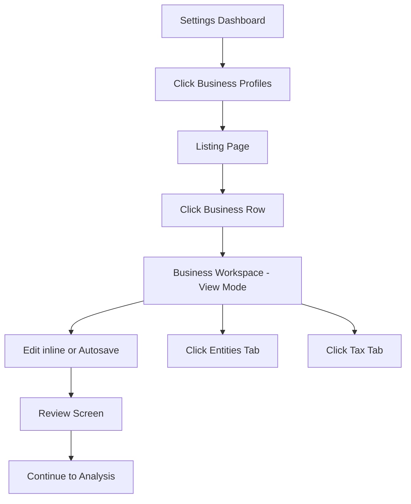
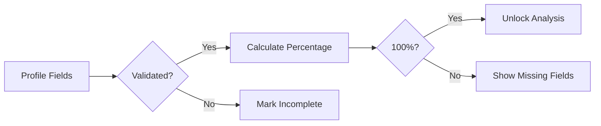
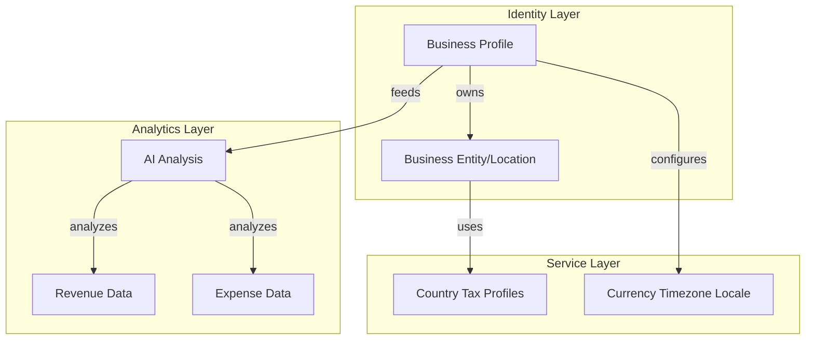
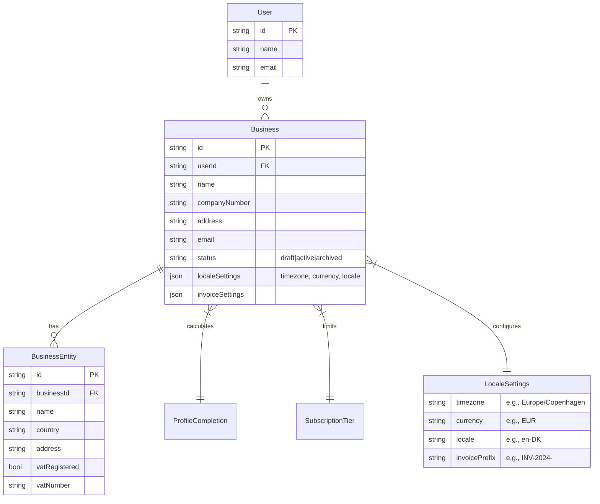

# Business Profile Settings Implementation Plan

## P-1 Core Architecture Principle

```text
Business Profile = Identity & Configuration Layer
Tax Intelligence = Separate Cached Service Layer
AI Analysis = Separate Analytics Layer
Accounting = Separate Financial Layer
```

Avoid building one giant business-management system early. Keep modules separated and composable.

---

## P-2 User Experience Flow

### S-1 Dashboard Navigation Flow


### S-2 Profile Completion Engine Flow


---

## P-3 Business Architecture

### S-1 Business Model Layers


### S-2 Multi-Business Requirements
- Each user can manage multiple businesses based on subscription/plan capability
- Business limit driven by subscription tier, not hardcoded
- Each business has: profile (identity), operations (locations), tax profiles (intelligence)
- Archive flow: soft-delete → 3 month grace period → (V1: no permanent delete)

### S-3 Status Flow


---

## P-4 Data Model Design

### S-1 Entity Relationship

#### U-1 Business Profile Schema


#### U-2 Tax Intelligence Layer (Cached)
```mermaid
erDiagram
    Country ||--|| CountryTaxProfile : defines

    Country {
        string code PK "e.g., DK, UK, US-NY"
        string name
    }

    CountryTaxProfile {
        string countryCode PK FK
        json vatRates
        json corporateTaxRates
        json filingDeadlines
        json requirements
        timestamp lastUpdated
        timestamp cachedAt
    }
```

---

## P-5 Development Implementation

### S-1 Data Model Changes
- Create `Business` table: id, userId, name, companyNumber, address, email, status (draft|active|archived)
- Add localeSettings JSON: timezone, currency, locale, invoicePrefix
- Create `BusinessEntity` table (renamed from Operation): id, businessId, name, country, address, vatRegistered, vatNumber
- Create `CountryTaxProfile` table: countryCode, vatRates, taxRates, deadlines, metadata (7-day cache)
- Create reusable Profile Completion engine (not business-specific)

### S-2 Business Workspace Layout
```text
[Company Logo]
Business Name - Completion % - AI Confidence %

• Overview         • Locations & Operations
• Tax & VAT        • Financial Settings
• Review & Validation
```

### S-3 Core Features
- Single workspace layout with left sidebar or top tabs
- Inline editing with autosave
- Business limit from subscription tier (not hardcoded)
- Archive = soft delete (V1: no permanent deletion)

---

## P-6 Company Calculation Context Integration

The Company Setup Wizard output must become a `companyCalculationContext` that is passed into the existing analysis/KPI/profit-loss/cashflow logic.

### S-1 Required Types and Helpers
- `CompanySetupPayload` type
- `CompanyCalculationContext` type
- `buildCompanyCalculationContext(setupPayload)`
- `calculateSetupReviewFlags(context)`
- `applyCompanyContextToFinancialSummary(summary, context)`

### S-2 Integration Flow
```text
CSV upload / existing parsed rows
+
companyCalculationContext
→ existing deterministic calculation
→ financial summary
→ confidence labels
→ accountant review flags
→ AI narrative/report
```

### S-3 Key Rules
- Loan principal repayment is NOT a normal expense
- Loan interest IS an expense
- Credit card repayments must NOT double-count underlying expenses
- If tax/gross-net/accounting method/loan split is unknown, flag it (don't fake certainty)
- AI explanations must say "estimated" or "needs review" when setup data is incomplete

---

## P-7 V1 MVP Scope

### S-1 Include
- Business profiles with multi-location support
- Tax setup with VAT details
- Review screen with AI validation flags
- Completion score unlocking analysis
- Inline editing with autosave
- Archive flow (soft delete, 3-month recovery)
- Business limit from subscription tier
- Company Calculation Context integration

### S-2 Exclude (Future)
- Permanent delete workers
- Advanced automation
- Accounting integrations
- Invoice systems
- Live government APIs
- Complex role systems

---

## P-8 Review & Validation Screen

### S-1 Setup Accuracy
- Completion % prominently displayed
- Completed sections count
- Missing fields highlighted

### S-2 Accountant Review Flags
- Loan principal repayment = not normal expense (flag unknown treatment)
- Loan interest = expense
- Credit card repayment should not duplicate underlying expenses
- Leasing requires accountant review if treatment is unknown
- Insurance may need business/private percentage split
- Tax settings flagged if estimated/uncertain

### S-3 AI Confidence & Accuracy Layer
- AI Setup Confidence score
- Warnings for uncertain entries

## [suggestions - 2026-05-25 review]

T-311: Split business profile completion into field completion, page visit completion, and workflow completion so users understand what raises progress.
T-312: Add a topbar setup panel that lists missing profile, business, dataset, analysis, and page-visit items.
T-313: Add a guided setup tour that opens the exact dashboard pages needed for incomplete setup items.
T-314: Store page visits as non-feed activity so progress can use them without cluttering user activity history.
T-315: Add business-profile review flags for missing website, missing business email, vague industry, and short business descriptions.
- Smart recommendations

---

## [suggestions]

### File Implementation Suggestions
T-275: Break Company Calculation Context into separate type file for cleaner imports
T-276: Add TypeScript validation for Mermaid diagrams in pre-commit
T-277: Create draft PR template for plan review process

[additional]
Build a simple, professional Company Setup Wizard for UseClevr.

Goal:
Before a user analyzes CSV/business data, UseClevr should collect key company, tax, currency, revenue, expense, insurance, loan and leasing information. This setup will improve profit/loss, cashflow, tax estimate, insurance cost, loan/leasing and accountant-ready calculations.

Important:
Do NOT build OCR, document scanning, bank integrations or external accounting integrations in this version.
This is a fast MVP setup wizard with manual input, "Not sure" options, setup accuracy score and accountant review flags.

Create a new page:

/app/company-setup

or if the app structure requires it:

/app/app/company-setup

Use the existing UseClevr UI style:
- modern
- clean
- dark/light mode compatible
- cyan/purple accents
- rounded cards
- minimal scrolling
- mobile responsive
- professional business SaaS look

The wizard should have these steps:

1. Company
2. Tax
3. Currency
4. Revenue
5. Expenses
6. Insurance
7. Loans & Leasing
8. Review

Use a simple progress bar at the top.
Use Back and Next buttons.
Use one main card per step.
Autosave locally in state first.
On final submit, prepare a JSON payload that can be saved later to backend/database.

Step 1: Company

Fields:
- companyName
- countryOfRegistration
- taxResidenceCountry
- legalStructure
- industry
- accountingMethod

Options:
legalStructure:
- Sole proprietor
- Limited liability company
- Corporation
- Partnership
- Non-profit
- Other
- Not sure

accountingMethod:
- Cash basis
- Accrual basis
- Not sure

Step 2: Tax

Fields:
- taxRegistered
- taxType
- standardTaxRate
- revenueAmountType
- expenseAmountType
- estimateTaxes

Options:
taxRegistered:
- Yes
- No
- Not sure

taxType:
- VAT
- GST
- Sales Tax
- None
- Not sure

revenueAmountType:
- Gross, tax included
- Net, tax excluded
- Mixed
- Not sure

expenseAmountType:
- Gross, tax included
- Net, tax excluded
- Mixed
- Not sure

estimateTaxes:
- Yes
- No
- Not sure

Step 3: Currency

Fields:
- primaryCurrency
- reportingCurrency
- otherCurrenciesUsed

Options:
primaryCurrency / reportingCurrency:
- EUR
- USD
- GBP
- RON
- HUF
- CHF
- Other

otherCurrenciesUsed:
multi-select or comma-separated input.

Step 4: Revenue

Fields:
- revenueSources
- customerType
- invoiceOrPaymentBased
- paymentProviders
- hasRefundsOrChargebacks

Options:
revenueSources:
- Product sales
- Services
- Subscriptions
- Marketplace sales
- Consulting
- Affiliate / commissions
- Licensing
- Other

customerType:
- B2B
- B2C
- Marketplace
- Government
- Mixed
- Not sure

invoiceOrPaymentBased:
- Count revenue when invoice is created
- Count revenue when payment arrives
- Not sure

paymentProviders:
- Stripe
- PayPal
- Wise
- Revolut
- Shopify Payments
- Amazon / Marketplace
- Bank transfer
- Cash
- Other

hasRefundsOrChargebacks:
- Yes
- No
- Not sure

Step 5: Expenses

Fields:
- expenseCategories
- hasMixedBusinessPrivateExpenses
- receiptsAvailable
- hasRecurringExpenses

Options:
expenseCategories:
- Software / SaaS
- Hosting / cloud
- Marketing / ads
- Office / rent
- Travel
- Meals
- Contractors
- Payroll
- Insurance
- Bank fees
- Payment processing fees
- Legal
- Accounting
- Taxes paid
- Materials / inventory
- Vehicle
- Loan interest
- Lease payments
- Other

hasMixedBusinessPrivateExpenses:
- Yes
- No
- Not sure

receiptsAvailable:
- Yes
- No
- Partly
- Not sure

hasRecurringExpenses:
- Yes
- No
- Not sure

Step 6: Insurance

Fields:
- hasBusinessInsurance
- insuranceTypes
- insurancePremiumAmount
- insurancePaymentFrequency
- insuranceBusinessUsePercentage

Options:
hasBusinessInsurance:
- Yes
- No
- Not sure

insuranceTypes:
- General liability
- Professional liability
- Cyber insurance
- Product liability
- Business property
- Vehicle insurance
- Health insurance
- Workers compensation
- Employer liability
- Directors & Officers
- Travel insurance
- Key person insurance
- Other

insurancePaymentFrequency:
- Monthly
- Quarterly
- Yearly
- One-time
- Not sure

insuranceBusinessUsePercentage:
- 100%
- 75%
- 50%
- 25%
- Not sure

Important conditional UI:
Only show insurance detail fields if hasBusinessInsurance is Yes or Not sure.

Step 7: Loans & Leasing

Fields:
- hasBusinessLoans
- hasLeasing
- hasCreditCards
- hasOverdraft
- monthlyDebtPayment
- loanInterestKnown
- principalInterestSplitKnown

Options:
hasBusinessLoans:
- Yes
- No
- Not sure

hasLeasing:
- Yes
- No
- Not sure

hasCreditCards:
- Yes
- No
- Not sure

hasOverdraft:
- Yes
- No
- Not sure

loanInterestKnown:
- Yes
- No
- Not sure

principalInterestSplitKnown:
- Yes
- No
- Not sure

Important calculation note:
Loan principal repayment should NOT be treated as normal expense.
Loan interest should be treated as expense.
Credit card repayment should not duplicate underlying expenses.
Leasing treatment depends on lease type and may require accountant review.

Step 8: Review

Show:
- Setup Accuracy %
- Completed sections
- Missing or uncertain items
- Accountant review flags
- Final JSON preview in collapsible section
- Button: Save Company Setup
- Button: Continue to Analysis

Accuracy Score Logic:
Start with 0 points.
Add points for completed important fields.

Suggested scoring:
Company section: 20 points
Tax section: 20 points
Currency section: 10 points
Revenue section: 15 points
Expenses section: 15 points
Insurance section: 10 points
Loans & Leasing section: 10 points

If a critical field is "Not sure", reduce confidence or mark it as review-required.

Accountant Review Flags:
Create flags when:
- accountingMethod is Not sure
- taxRegistered is Not sure
- taxType is Not sure
- revenueAmountType is Mixed or Not sure
- expenseAmountType is Mixed or Not sure
- estimateTaxes is Not sure
- hasBusinessInsurance is Yes but business use percentage is missing or Not sure
- hasBusinessLoans is Yes but interest is not known
- hasLeasing is Yes
- principalInterestSplitKnown is No or Not sure
- hasMixedBusinessPrivateExpenses is Yes or Not sure

Final JSON structure:

{
  "companyInfo": {
    "companyName": "",
    "countryOfRegistration": "",
    "taxResidenceCountry": "",
    "legalStructure": "",
    "industry": "",
    "accountingMethod": ""
  },
  "taxSettings": {
    "taxRegistered": "",
    "taxType": "",
    "standardTaxRate": "",
    "revenueAmountType": "",
    "expenseAmountType": "",
    "estimateTaxes": ""
  },
  "currencySettings": {
    "primaryCurrency": "",
    "reportingCurrency": "",
    "otherCurrenciesUsed": []
  },
  "revenueRules": {
    "revenueSources": [],
    "customerType": "",
    "invoiceOrPaymentBased": "",
    "paymentProviders": [],
    "hasRefundsOrChargebacks": ""
  },
  "expenseRules": {
    "expenseCategories": [],
    "hasMixedBusinessPrivateExpenses": "",
    "receiptsAvailable": "",
    "hasRecurringExpenses": ""
  },
  "insuranceSettings": {
    "hasBusinessInsurance": "",
    "insuranceTypes": [],
    "insurancePremiumAmount": "",
    "insurancePaymentFrequency": "",
    "insuranceBusinessUsePercentage": ""
  },
  "loanLeasingSettings": {
    "hasBusinessLoans": "",
    "hasLeasing": "",
    "hasCreditCards": "",
    "hasOverdraft": "",
    "monthlyDebtPayment": "",
    "loanInterestKnown": "",
    "principalInterestSplitKnown": ""
  },
  "setupStatus": {
    "setupAccuracy": 0,
    "completedSections": [],
    "missingFields": [],
    "accountantReviewFlags": []
  }
}

Implementation Requirements:
- Use React / Next.js App Router.
- Use TypeScript.
- Use existing project components if available.
- Keep code minimal and clean.
- Avoid overengineering.
- No new complex dependencies unless already available.
- Do not break existing analysis flow.
- Add route/page only.
- If backend save endpoint already exists, use it.
- If not, keep submit handler prepared with console.log(payload) and TODO comment for backend persistence.
- Make sure the page compiles.
- Make sure dark/light mode does not break.
- No placeholder lorem ipsum.
- No raw broken JSON visible except in the collapsible review section.
- Keep labels simple and user-friendly.

UX Details:
- Every difficult question must include "Not sure".
- "Not sure" should never block the user.
- Show helper text under important questions:
  Example:
  "Loan repayments affect cashflow, but only the interest part is usually treated as an expense."
- Show a small right-side or bottom "Accuracy Preview" panel:
  Revenue: High/Medium/Low
  Tax: High/Medium/Low
  Expenses: High/Medium/Low
  Loans/Leasing: High/Medium/Low
  Overall setup: percentage

Deliverable:
Create the full working Company Setup Wizard page with all steps, state handling, validation-lite, accuracy calculation, accountant review flags and final payload generation.

---

### Additional Suggestions
T-294: Add business profile import/export functionality for backup and migration
T-295: Add business profile validation rules with real-time feedback
T-296: Implement business profile templates for common business types
T-297: Add multi-currency support to business profile settings
T-298: Create business profile audit log for tracking changes
T-299: Add business profile sharing between team members
T-300: Implement business profile version history with rollback
T-301: Add business profile API for third-party integrations
T-302: Create business profile completion wizard with progress steps
T-303: Add business profile analytics dashboard for insights
T-304: Implement business profile data privacy controls
T-305: Add business profile notifications for incomplete sections
T-306: Create business profile import from LinkedIn/other sources
T-307: Add business profile custom field support
T-308: Implement business profile search and filtering
T-309: Add business profile bulk edit capabilities
T-310: Create business profile public profile page option
