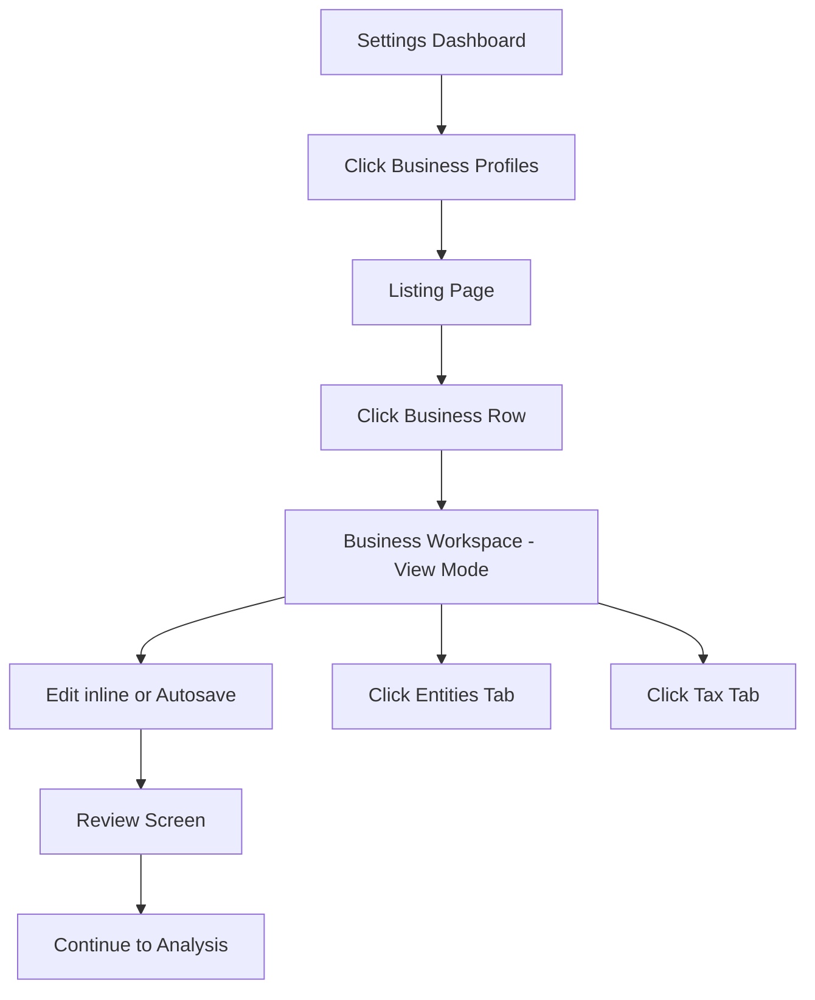
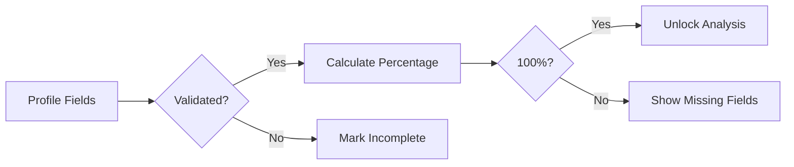
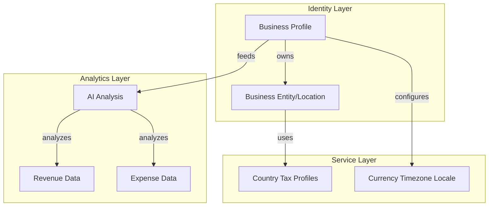
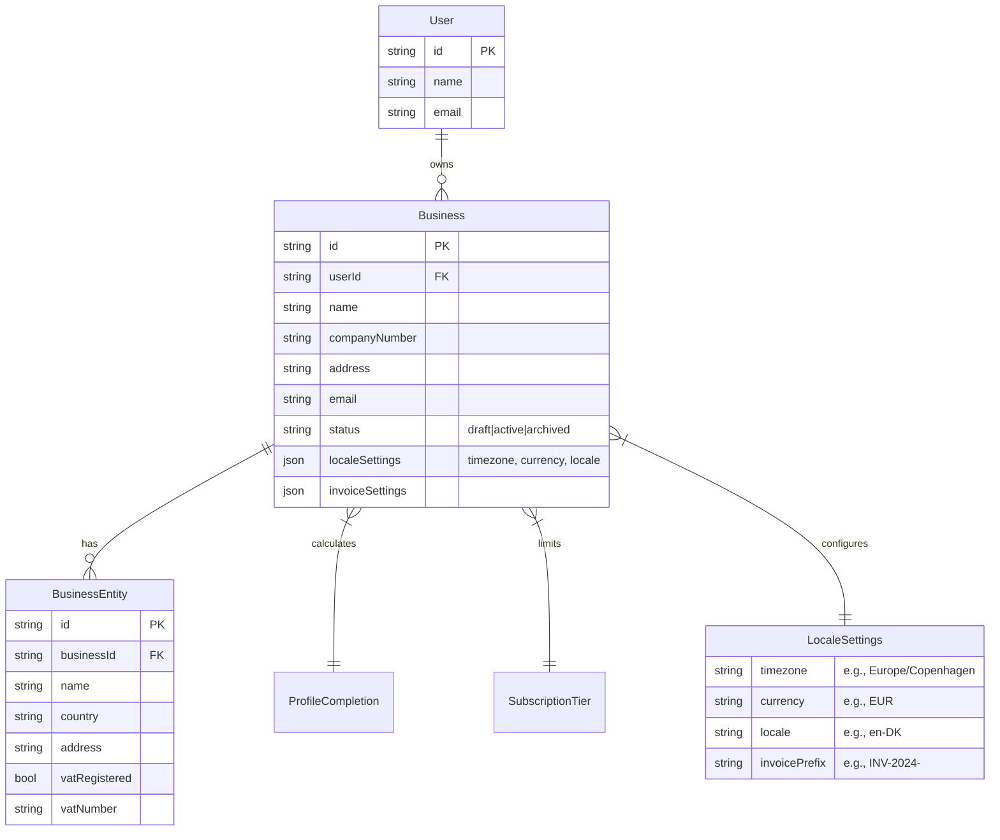

# Business Profile Settings Implementation Plan

## P-1 Core Architecture Principle

```text
Business Profile = Identity & Configuration Layer
Tax Intelligence = Separate Cached Service Layer
AI Analysis = Separate Analytics Layer
Accounting = Separate Financial Layer
```

Avoid building one giant business-management system early. Keep modules separated and composable.

---

## P-2 User Experience Flow

### S-1 Dashboard Navigation Flow


### S-2 Profile Completion Engine Flow


---

## P-3 Business Architecture

### S-1 Business Model Layers


### S-2 Multi-Business Requirements
- Each user can manage multiple businesses based on subscription/plan capability
- Business limit driven by subscription tier, not hardcoded
- Each business has: profile (identity), operations (locations), tax profiles (intelligence)
- Archive flow: soft-delete → 3 month grace period → (V1: no permanent delete)

### S-3 Status Flow


---

## P-4 Data Model Design

### S-1 Entity Relationship

#### U-1 Business Profile Schema


#### U-2 Tax Intelligence Layer (Cached)
```mermaid
erDiagram
    Country ||--|| CountryTaxProfile : defines

    Country {
        string code PK "e.g., DK, UK, US-NY"
        string name
    }

    CountryTaxProfile {
        string countryCode PK FK
        json vatRates
        json corporateTaxRates
        json filingDeadlines
        json requirements
        timestamp lastUpdated
        timestamp cachedAt
    }
```

---

## P-5 Development Implementation

### S-1 Data Model Changes
- Create `Business` table: id, userId, name, companyNumber, address, email, status (draft|active|archived)
- Add localeSettings JSON: timezone, currency, locale, invoicePrefix
- Create `BusinessEntity` table (renamed from Operation): id, businessId, name, country, address, vatRegistered, vatNumber
- Create `CountryTaxProfile` table: countryCode, vatRates, taxRates, deadlines, metadata (7-day cache)
- Create reusable Profile Completion engine (not business-specific)

### S-2 Business Workspace Layout
```text
[Company Logo]
Business Name - Completion % - AI Confidence %

• Overview         • Locations & Operations
• Tax & VAT        • Financial Settings
• Review & Validation
```

### S-3 Core Features
- Single workspace layout with left sidebar or top tabs
- Inline editing with autosave
- Business limit from subscription tier (not hardcoded)
- Archive = soft delete (V1: no permanent deletion)

---

## P-6 Company Calculation Context Integration

The Company Setup Wizard output must become a `companyCalculationContext` that is passed into the existing analysis/KPI/profit-loss/cashflow logic.

### S-1 Required Types and Helpers
- `CompanySetupPayload` type
- `CompanyCalculationContext` type
- `buildCompanyCalculationContext(setupPayload)`
- `calculateSetupReviewFlags(context)`
- `applyCompanyContextToFinancialSummary(summary, context)`

### S-2 Integration Flow
```text
CSV upload / existing parsed rows
+
companyCalculationContext
→ existing deterministic calculation
→ financial summary
→ confidence labels
→ accountant review flags
→ AI narrative/report
```

### S-3 Key Rules
- Loan principal repayment is NOT a normal expense
- Loan interest IS an expense
- Credit card repayments must NOT double-count underlying expenses
- If tax/gross-net/accounting method/loan split is unknown, flag it (don't fake certainty)
- AI explanations must say "estimated" or "needs review" when setup data is incomplete

---

## P-7 V1 MVP Scope

### S-1 Include
- Business profiles with multi-location support
- Tax setup with VAT details
- Review screen with AI validation flags
- Completion score unlocking analysis
- Inline editing with autosave
- Archive flow (soft delete, 3-month recovery)
- Business limit from subscription tier
- Company Calculation Context integration

### S-2 Exclude (Future)
- Permanent delete workers
- Advanced automation
- Accounting integrations
- Invoice systems
- Live government APIs
- Complex role systems

---

## P-8 Review & Validation Screen

### S-1 Setup Accuracy
- Completion % prominently displayed
- Completed sections count
- Missing fields highlighted

### S-2 Accountant Review Flags
- Loan principal repayment = not normal expense (flag unknown treatment)
- Loan interest = expense
- Credit card repayment should not duplicate underlying expenses
- Leasing requires accountant review if treatment is unknown
- Insurance may need business/private percentage split
- Tax settings flagged if estimated/uncertain

### S-3 AI Confidence & Accuracy Layer
- AI Setup Confidence score
- Warnings for uncertain entries
- Smart recommendations

---

## [suggestions]

### File Implementation Suggestions
T-275: Break Company Calculation Context into separate type file for cleaner imports
T-276: Add TypeScript validation for Mermaid diagrams in pre-commit
T-277: Create draft PR template for plan review process
T-294: Add business profile import/export functionality for backup and migration
T-295: Add business profile validation rules with real-time feedback
T-296: Implement business profile templates for common business types
T-297: Add multi-currency support to business profile settings
T-298: Create business profile audit log for tracking changes
T-299: Add business profile sharing between team members
T-300: Implement business profile version history with rollback
T-301: Add business profile API for third-party integrations
T-302: Create business profile completion wizard with progress steps
T-303: Add business profile analytics dashboard for insights
T-304: Implement business profile data privacy controls
T-305: Add business profile notifications for incomplete sections
T-306: Create business profile import from LinkedIn/other sources
T-307: Add business profile custom field support
T-308: Implement business profile search and filtering
T-309: Add business profile bulk edit capabilities
T-310: Create business profile public profile page option