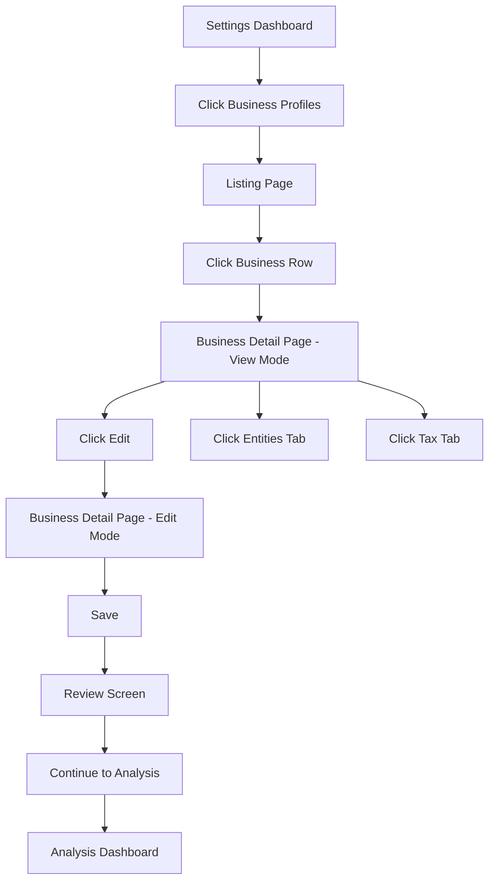
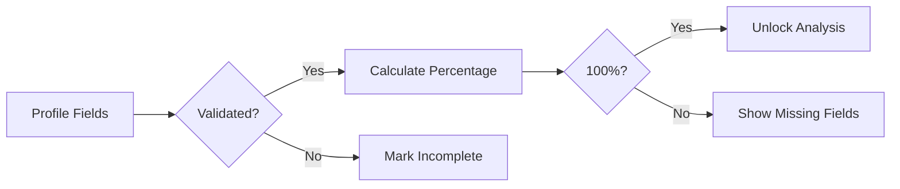
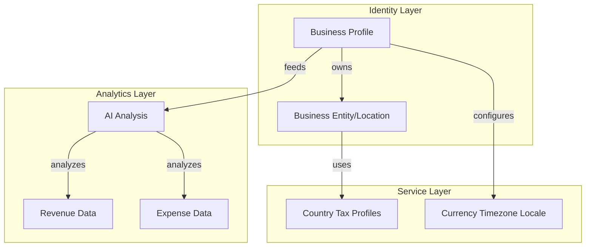
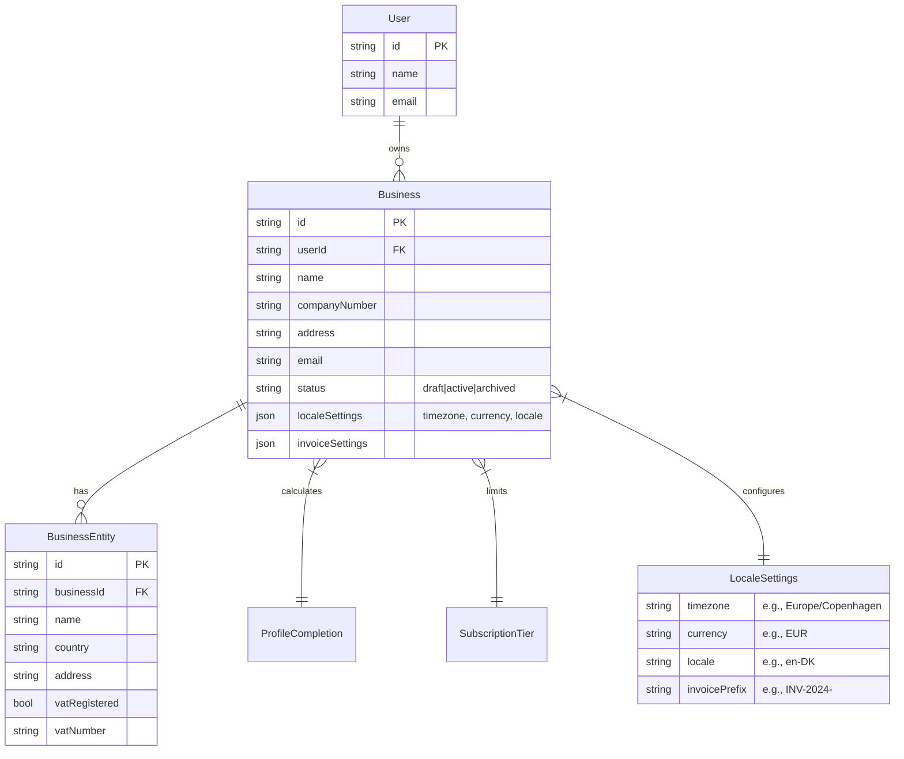

# Business Profile Settings Implementation Plan

## Table of Contents

- [S1: Overview](#s1-overview)
- [S2: Data Model Changes](#s2-data-model-changes)
- [S3: Business Profile Listing Page](#s3-business-profile-listing-page)
- [S4: Individual Business Profile Page](#s4-individual-business-profile-page)
- [S5: Business Operations](#s5-business-operations)
- [S6: Tax & Accountancy Details](#s6-tax--accountancy-details)
- [S7: Review & Validation Screen](#s7-review--validation-screen)
- [S8: User Flows & Navigation](#s8-user-flows--navigation)

---

## S1: Overview

Multi-business support for user accounts in the dashboard. Each user can manage up to 3 businesses (limit configurable by super-admin). Each business has its own profile, operations, and tax details.

---

## S2: Data Model Changes

Database schema updates required for multi-business support.

### T2.1 Business Table

- [ ] Create `Business` table with fields: id, userId, name, companyNumber, address, email, phone, website, description
- [ ] Add createdAt, updatedAt timestamps
- [ ] Foreign key to User table

### T2.2 BusinessOperation Table

- [ ] Create `BusinessOperation` table with fields: id, businessId, country, address, currency, taxDetails (JSON)
- [ ] One-to-many relationship to Business

### T2.3 Tax Details Cache

- [ ] Add tax details caching mechanism (7-day cache for auto-loaded tax data)
- [ ] Fields: taxRates, filingDates, localRequirements (JSON)

### T2.4 Soft Delete for Business Archive

- [ ] Add `archivedAt` timestamp field
- [ ] Add `status` enum (active, archived, deleted)
- [ ] Add `deletedAt` timestamp for permanent deletion tracking

---

## S3: Business Profile Listing Page

Main dashboard page listing all businesses for a user.

### T3.1 Page Layout

- [ ] Create `/settings/businesses/page.tsx`
- [ ] List businesses in row format (similar to customer rows pattern)
- [ ] Show business name, location, operation count, completion status

### T3.2 Business Limit Enforcement

- [ ] Super-admin setting: maximum businesses per user (default: 3)
- [ ] Disable "Add Business" button when limit reached
- [ ] Show upgrade prompt when limit reached

### T3.3 Row Actions

- [ ] View button - navigate to business detail page
- [ ] Archive button - opens confirmation modal with type-in-name validation
- [ ] Archive = soft delete, permanently deleted after 3 months

---

## S4: Individual Business Profile Page

Dynamic page for each business with view and edit modes.

### T4.1 View/Edit Toggle

- [ ] Default to view mode
- [ ] Edit button switches to edit mode
- [ ] Save/Cancel buttons in edit mode

### T4.2 Company Official Details Section

- [ ] Company name and number
- [ ] Company address (multi-line)
- [ ] Company email and phone
- [ ] Website URL
- [ ] Business description

### T4.3 Account Yearly Rolling Setting

- [ ] Tax year start/end dates
- [ ] Fiscal year configuration

---

## S5: Business Operations

Operations for each business with country-specific tax details.

### T5.1 Operations List

- [ ] List all operations for a business
- [ ] Each operation shows: country, address, currency

### T5.2 Tax Details Panel

- [ ] Read-only display of auto-loaded tax details
- [ ] Cached for 7 days
- [ ] Shows: currency, tax % rates, tax types

### T5.3 Country-Based Auto-Tax Loading

- [ ] Map operation address to country
- [ ] Load country-specific tax defaults
- [ ] Manual override option

---

## S6: Tax & Accountancy Details

Preferences and settings for bookkeeping and accounting.

### T6.1 Prerequisites

- [ ] Tax preferences only available after at least one operation exists

### T6.2 Book/Accountancy Details

- [ ] Currency selection
- [ ] Tax dates configuration
- [ ] Reporting preferences

### T6.3 Financial Overview

- [ ] Total Revenue (manual entry or auto-calculated)
- [ ] Total Expenses breakdown:
  - [ ] Insurance
  - [ ] Loans & Leasing

---

## S7: Review & Validation Screen

Final review before completing business setup.

### T7.1 Setup Accuracy

- [ ] Calculate completion percentage
- [ ] Show completed sections count
- [ ] Highlight missing fields

### T7.2 Accountant Review Flags

- [ ] Loan principal repayment = not normal expense (flag unknown treatment)
- [ ] Loan interest = expense
- [ ] Credit card repayment should not duplicate underlying expenses (flag potential duplicates)
- [ ] Leasing requires accountant review if treatment is unknown
- [ ] Insurance may need business/private percentage split
- [ ] Tax settings flagged if estimated/uncertain

### T7.3 Review Display

- [ ] Setup Accuracy % prominently displayed
- [ ] Collapsible JSON preview for debugging
- [ ] Save Company Setup button
- [ ] Continue to Analysis button

---

## S8: User Flows & Navigation

Navigation structure and user experience flows.

### T8.1 Navigation Flow

1. User accesses Settings → Business Profiles
2. Lands on listing page showing all businesses
3. Each business row links to `/settings/businesses/[id]`
4. Business detail page shows view mode by default
5. Edit mode reveals all form fields
6. Final step: Review screen before completing setup

### T8.2 Archive Flow

- [ ] Click archive triggers confirmation dialog
- [ ] User must type business name to confirm
- [ ] Business moves to archived state
- [ ] 3-month grace period for recovery
- [ ] Permanent deletion after 3 months

### T8.3 Update Guides

- [ ] Update user guide documentation
- [ ] Update developer documentation for new schema

ADDITIONAL INFO:

Strong direction overall. Main improvement: keep V1 simpler and separate “business identity” from “tax/accountancy intelligence”.

Recommended adjustments:

Remove hardcoded “3 businesses” from backend logic → use subscription/plan capability system from start.
taxDetails (JSON) is too generic → split:
taxCountry
taxSystem
vatRegistered
vatNumber
taxMetadata JSON
Avoid storing auto-loaded tax rules directly in operation rows. Create separate:
CountryTaxProfile
cached centrally.
“Operation” naming may confuse users. Consider:
BusinessEntity
BusinessLocation
BusinessRegion
depending on actual meaning.
Do not implement permanent delete worker yet. Soft archive is enough for V1.
Review screen is very good differentiator for UseClevr.
Accountant review flags = strong feature, keep.
“Collapsible JSON debug” should be admin/dev only.
Revenue/Expenses manual entry should later connect to CSV/AI analysis automatically.
Add:
timezone
default currency
locale
invoice numbering preference
early in schema.
Add status:
draft
active
archived
instead of only active/archive/delete.
Add profile completion system as reusable engine, not business-only.

Most important architecture advice:

Business Profile = identity/configuration layer
AI Analysis = separate analytics layer
Tax Intelligence = separate cached service layer

Do not mix all into one giant business table/service early.

[additional]

# Business Profile Settings Implementation Plan

## Table of Contents

- [S1: User Experience Flow](#s1-user-experience-flow)
- [S2: Business Architecture](#s2-business-architecture)
- [S3: Data Model Design](#s3-data-model-design)
- [S4: Development Implementation](#s4-development-implementation)
  - [S4.1 Data Model Changes](#s41-data-model-changes)
  - [S4.2 Business Profile Listing Page](#s42-business-profile-listing-page)
  - [S4.3 Individual Business Profile Page](#s43-individual-business-profile-page)
  - [S4.4 Business Operations](#s44-business-operations)
  - [S4.5 Tax & Accountancy Details](#s45-tax--accountancy-details)
  - [S4.6 Review & Validation Screen](#s46-review--validation-screen)
- [S5: User Flows & Navigation](#s5-user-flows--navigation)

---

## S1: User Experience Flow

### L1 Dashboard Navigation Flow



### L2 Profile Completion Engine Flow



---

## S2: Business Architecture

### L1 Business Model Layers



### L2 Multi-Business Requirements

- Each user can manage multiple businesses based on subscription/plan capability
- Business limit driven by subscription tier, not hardcoded
- Each business has: profile (identity), operations (locations), tax profiles (intelligence)
- Archive flow: soft-delete → 3 month grace period → (V1: no permanent delete)

### L3 Status Flow


---

## S3: Data Model Design

### L1 Entity Relationship

#### Business Profile Schema



#### Tax Intelligence Layer (Cached)

```mermaid
erDiagram
    Country ||--|| CountryTaxProfile : defines

    Country {
        string code PK "e.g., DK, UK, US-NY"
        string name
    }

    CountryTaxProfile {
        string countryCode PK FK
        json vatRates
        json corporateTaxRates
        json filingDeadlines
        json requirements
        timestamp lastUpdated
        timestamp cachedAt
    }
```

---

## S4: Development Implementation

---

### S4.1 Data Model Changes

Database schema updates for multi-business support.

#### T4.1.1 Business Table

- [ ] Create `Business` table with fields: id, userId, name, companyNumber, address, email, status (draft|active|archived)
- [ ] Add localeSettings JSON: timezone, currency, locale, invoicePrefix
- [ ] Add invoiceSettings JSON
- [ ] Foreign key to User table

#### T4.1.2 BusinessEntity Table (renamed from Operation)

- [ ] Create `BusinessEntity` table with fields: id, businessId, name, country, address
- [ ] Add tax fields: vatRegistered (bool), vatNumber
- [ ] One-to-many relationship to Business

#### T4.1.3 CountryTaxProfile Table (cached service)

- [ ] Create `CountryTaxProfile` table with fields: countryCode, vatRates, taxRates, deadlines, metadata
- [ ] 7-day cache for auto-loaded tax data
- [ ] Separate from operation rows for cleaner architecture

#### T4.1.4 Profile Completion Engine

- [ ] Create reusable profile completion engine (not business-specific)
- [ ] Track completion percentage per business
- [ ] Unlock features at 100% completion

---

### S4.2 Business Profile Listing Page

Main dashboard page listing all businesses for a user.

#### T4.2.1 Page Layout

- [ ] Create `/settings/businesses/page.tsx`
- [ ] List businesses in row format (similar to customer rows pattern)
- [ ] Show business name, location, entity count, completion status

#### T4.2.2 Subscription-Based Limit Enforcement

- [ ] Add to User/Subscription context: maxBusinesses (from plan tier)
- [ ] Disable "Add Business" button when limit reached
- [ ] Show upgrade prompt when limit reached

#### T4.2.3 Row Actions

- [ ] View button - navigate to business detail page
- [ ] Archive button - opens confirmation modal with type-in-name validation
- [ ] Archive = soft delete (V1: no permanent deletion)

---

### S4.3 Individual Business Profile Page

Dynamic page for each business with view and edit modes.

#### T4.3.1 View/Edit Toggle

- [ ] Default to view mode
- [ ] Edit button switches to edit mode
- [ ] Save/Cancel buttons in edit mode

#### T4.3.2 Company Official Details Section

- [ ] Company name and number
- [ ] Company address (multi-line)
- [ ] Company email and phone
- [ ] Website URL
- [ ] Business description

#### T4.3.3 Locale & Invoice Settings

- [ ] Timezone selector
- [ ] Default currency selection
- [ ] Locale selector
- [ ] Invoice numbering preference

#### T4.3.4 Account Yearly Rolling Setting

- [ ] Tax year start/end dates
- [ ] Fiscal year configuration

---

### S4.4 Business Operations (BusinessEntity)

Operations for each business with country-specific tax details.

#### T4.4.1 Entities List

- [ ] List all entities for a business
- [ ] Each entity shows: country, address, VAT registered status

#### T4.4.2 Tax Details Panel (from CountryTaxProfile)

- [ ] Read-only display of cached tax details
- [ ] Cached for 7 days
- [ ] Shows: currency, tax % rates, filing deadlines

#### T4.4.3 Country-Based Auto-Tax Loading

- [ ] Map entity address to country
- [ ] Load country-specific tax defaults from CountryTaxProfile
- [ ] Manual override option

---

### S4.5 Tax & Accountancy Details

Preferences and settings for bookkeeping and accounting.

#### T4.5.1 Prerequisites

- [ ] Tax preferences only available after at least one entity exists

#### T4.5.2 Book/Accountancy Details

- [ ] Currency selection (already in locale settings)
- [ ] Tax dates configuration
- [ ] Reporting preferences

#### T4.5.3 Financial Overview (V1 Manual)

- [ ] Total Revenue (manual entry in V1)
- [ ] Total Expenses breakdown:
  - [ ] Insurance
  - [ ] Loans & Leasing
- [ ] Future: connect to CSV/AI analysis automatically

---

### S4.6 Review & Validation Screen

Final review before completing business setup.

#### T4.6.1 Setup Accuracy

- [ ] Calculate completion percentage (from ProfileCompletion engine)
- [ ] Show completed sections count
- [ ] Highlight missing fields

#### T4.6.2 Accountant Review Flags

- [ ] Loan principal repayment = not normal expense (flag unknown treatment)
- [ ] Loan interest = expense
- [ ] Credit card repayment should not duplicate underlying expenses (flag potential duplicates)
- [ ] Leasing requires accountant review if treatment is unknown
- [ ] Insurance may need business/private percentage split
- [ ] Tax settings flagged if estimated/uncertain

#### T4.6.3 Review Display

- [ ] Setup Accuracy % prominently displayed
- [ ] Collapsible JSON preview (admin/dev only)
- [ ] Save Company Setup button
- [ ] Continue to Analysis button

---

## S5: User Flows & Navigation

### L1 Navigation Flow Steps

1. User accesses Settings → Business Profiles
2. Lands on listing page showing all businesses
3. Each business row links to `/settings/businesses/[id]`
4. Business detail page shows view mode by default
5. Edit mode reveals all form fields
6. Final step: Review screen before completing setup

### L2 Archive Flow Steps

- [ ] Click archive triggers confirmation dialog
- [ ] User must type business name to confirm
- [ ] Business moves to archived state
- [ ] 3-month grace period for recovery (V1: no automatic deletion)

### L3 Update Guides

- [ ] Update user guide documentation
- [ ] Update developer documentation for new schema

---

[ADDITIONAL]

# Optimized Business Profile & Tax Intelligence Plan

## Core Architecture Principle

```text
Business Profile = Identity & Configuration Layer
Tax Intelligence = Separate Cached Service Layer
AI Analysis = Separate Analytics Layer
Accounting = Separate Financial Layer
```

Avoid building one giant business-management system early. Keep modules separated and composable.

---

# 1. Optimized User Flow

## Previous Flow

```text
Businesses List
→ Business Detail
→ Edit Mode
→ Operations
→ Tax Settings
→ Review
→ Save
```

## Optimized Condensed Flow

```text
Business List
→ Business Workspace
   ├── Overview
   ├── Locations & Operations
   ├── Tax & Accounting
   ├── Financial Setup
   └── Review & Accuracy
```

Instead of multiple isolated pages/modals, use:

- single workspace layout
- left sidebar navigation OR top tabs
- autosave where possible
- inline editing instead of separate edit mode

This reduces navigation fatigue.

---

# 2. Recommended UI Structure

## Business Workspace Layout

### Left Sidebar

```text
[Company Logo]
Business Name
Completion %

• Overview
• Operations & Countries
• Tax & VAT
• Financial Settings
• Accounting Flags
• Review & Validation
```

### Main Content Area

- section cards
- collapsible groups
- progressive disclosure
- validation indicators

---

# 3. Flowchart Optimization

Instead of dots between steps:

```text
● → ● → ●
```

Use connected progress lines:

```text
Overview ━━━ Operations ━━━ Tax ━━━ Financials ━━━ Review
```

Benefits:

- clearer progression
- more enterprise feel
- easier to understand current position
- visually cleaner

Recommended:

- active step highlighted
- completion checkmarks
- warning icons for missing critical data

---

# 4. Additional Important Sections

## 4.1 Compliance & Legal

Add lightweight legal section:

- VAT registered
- EU OSS/IOSS
- Business type
- Tax residency
- Employee count
- Industry category

This becomes important later for AI-driven accounting interpretation.

---

## 4.2 AI Confidence & Accuracy Layer

Strong differentiator for UseClevr.

### Example

```text
AI Setup Confidence: 87%

Warnings:
- Loan repayment may not be deductible
- VAT setup incomplete
- Insurance classification uncertain
```

This gives:

- enterprise trust
- transparency
- accountant-friendly workflow
- AI reliability scoring

---

## 4.3 Smart Recommendations

AI assistant should proactively suggest:

- missing VAT setup
- duplicated expenses
- currency mismatches
- unusual reporting periods
- missing tax dates
- insurance inconsistencies

This is a strong innovation opportunity.

---

## 4.4 Country Tax Intelligence Layer

Do not hardcode tax logic into business rows.

Recommended architecture:

```text
CountryTaxProfile
├── countryCode
├── VAT defaults
├── filing schedules
├── deductible categories
├── reporting requirements
└── cache expiration
```

Business only references:

```text
countryTaxProfileId
```

This avoids duplicated tax logic.

---

# 5. Data Model Optimizations

## Business Table

Recommended additions:

```text
status: draft | active | archived
locale
timezone
defaultCurrency
industry
businessType
vatRegistered
vatNumber
completionScore
aiConfidenceScore
```

---

## Operations Table

Rename suggestion:

```text
BusinessLocation
```

More user friendly than:

```text
BusinessOperation
```

Suggested fields:

```text
country
currency
taxSystem
vatApplicable
employeeCount
address
```

---

# 6. Review Screen Optimization

Current review idea is strong.

Improve with:

## Split Review Areas

### Business Identity

- company data
- registration
- address

### Tax Setup

- VAT
- filing periods
- regional requirements

### Financial Structure

- loans
- leasing
- insurance
- recurring expenses

### AI Risk Flags

- uncertain entries
- duplicate risks
- missing documents

---

# 7. UX Optimization Recommendations

## Recommended

### Inline Editing

Avoid:

```text
View Mode → Edit Mode
```

Use:

```text
click field → edit inline
```

Much faster.

---

## Autosave

Avoid manual save after every section.

Use:

```text
Saving...
Saved ✓
```

---

## Sticky Progress Header

Always show:

```text
Business Name
Completion %
AI Confidence %
Missing Critical Items
```

---

# 8. Important Future-Proofing

## Keep Business Profile Separate From:

- CSV ingestion
- AI analysis engine
- accounting exports
- report generation
- forecasting engine

Only connect through IDs/services.

This prevents massive future refactors.

---

# 9. Recommended MVP Scope

## V1 Should Include

### Core

- business profiles
- locations
- tax setup
- review screen
- AI validation flags
- completion score

### NOT V1

- permanent delete workers
- advanced automation
- accounting integrations
- invoice systems
- live government APIs
- complex role systems

Keep V1 lean and stable.

---

# 10. Strategic Product Differentiators

Potentially unique features:

```text
AI Setup Confidence
AI Accountant Flags
Country Tax Intelligence
Business Health Validation
Financial Consistency Checks
```

Most AI BI tools do not deeply validate accounting/tax/business setup consistency.

This can become a strong enterprise positioning advantage for UseClevr.
