# Dashboard Sitemap

This guide is a dashboard site plan for route planning, menu review, and wireframe discussions.
The Mermaid chart maps the main dashboard navigation and subpage bars. The route table below it
keeps the same pages clickable when Mermaid rendering is unavailable.

## Site Plan

```mermaid
flowchart TB
  root["Dashboard shell"]

  root --> home["Dashboard overview"]
  root --> dataMenu["Datasets menu"]
  root --> assistantMenu["AI Assistant menu"]
  root --> downloads["Reports and downloads"]
  root --> businessMenu["Business menu"]
  root --> accountancyMenu["Accountancy menu"]
  root --> supportMenu["Support menu"]
  root --> accountMenu["Account menu"]
  root --> adminMenu["Super-admin menu"]

  dataMenu --> datasets["Datasets table"]
  datasets --> datasetTable["Dataset table view"]
  datasets --> datasetAnalyze["Dataset analysis"]
  datasets --> upload["Upload dataset"]

  assistantMenu --> assistant["Assistant workspace"]
  assistantMenu --> assistantHistory["Assistant history"]

  businessMenu --> businessOverview["Business overview"]
  businessMenu --> businessProfile["Business profile"]
  businessMenu --> businessLocations["Business locations"]
  businessMenu --> businessTax["Business tax"]
  businessMenu --> businessFinancial["Business financial"]
  businessOverview --> businessReviewPanel["Review panel"]

  accountancyMenu --> accountancyOverview["Accountancy overview"]
  accountancyMenu --> accountancyReporting["Accountancy reporting"]
  accountancyMenu --> accountancyTax["Accountancy tax"]
  accountancyMenu --> accountancyCompliance["Accountancy compliance"]

  supportMenu --> faq["Dashboard FAQ"]
  supportMenu --> tickets["Tickets table"]
  tickets --> newTicket["New ticket"]
  tickets --> editTicket["Edit ticket"]

  accountMenu --> profile["Profile"]
  accountMenu --> preferences["Preferences"]
  accountMenu --> subscription["Subscription"]
  accountMenu --> billing["Billing"]
  accountMenu --> activity["Activity"]
  accountMenu --> checkout["Checkout"]

  adminMenu --> customers["Customers"]
  adminMenu --> levels["Customer levels"]
  adminMenu --> discounts["Discount rules"]
  adminMenu --> operatorFaq["Operator FAQ"]
  adminMenu --> payment["Payment setup"]
  adminMenu --> credits["Credit rules"]
  adminMenu --> totalActivity["Total activity"]

  click home "/app" "Dashboard overview"
  click datasets "/app/datasets" "Datasets table"
  click datasetTable "/app/datasets/[id]" "Dataset table view"
  click datasetAnalyze "/app/datasets/[id]/analyze" "Dataset analysis"
  click upload "/app/upload" "Upload dataset"
  click assistant "/app/assistant" "Assistant workspace"
  click assistantHistory "/app/assistant/history" "Assistant history"
  click downloads "/app/downloads" "Reports and downloads"
  click businessOverview "/app/business" "Business overview"
  click businessProfile "/app/business/profile" "Business profile"
  click businessLocations "/app/business/locations" "Business locations"
  click businessTax "/app/business/tax" "Business tax"
  click businessFinancial "/app/business/financial" "Business financial"
  click businessReviewPanel "/app/business" "Business review panel"
  click accountancyOverview "/app/accountancy" "Accountancy overview"
  click accountancyReporting "/app/accountancy/reporting" "Accountancy reporting"
  click accountancyTax "/app/accountancy/tax" "Accountancy tax"
  click accountancyCompliance "/app/accountancy/compliance" "Accountancy compliance"
  click faq "/app/faq" "Dashboard FAQ"
  click tickets "/app/tickets" "Tickets table"
  click newTicket "/app/tickets/new" "New ticket"
  click editTicket "/app/tickets/[id]" "Edit ticket"
  click profile "/app/settings/profile" "Profile"
  click preferences "/app/settings/preferences" "Preferences"
  click subscription "/app/settings/subscription" "Subscription"
  click billing "/app/settings/billing" "Billing"
  click activity "/app/settings/activity" "Activity"
  click checkout "/app/settings/checkout" "Checkout"
  click customers "/app/admin/customers" "Customers"
  click levels "/app/admin/levels" "Customer levels"
  click discounts "/app/admin/discounts" "Discount rules"
  click operatorFaq "/app/faq?scope=operator" "Operator FAQ"
  click payment "/app/settings/payment" "Payment setup"
  click credits "/app/settings/credits" "Credit rules"
  click totalActivity "/app/settings/total-activity" "Total activity"
```

## Linked Menu Map

| Menu area    | Page                                                                   | Route                           |
| ------------ | ---------------------------------------------------------------------- | ------------------------------- |
| Dashboard    | [Overview](https://app.useclevr.com/app)                               | `/app`                          |
| Datasets     | [Datasets table](https://app.useclevr.com/app/datasets)                | `/app/datasets`                 |
| Datasets     | [Dataset table view](https://app.useclevr.com/app/datasets/[id])       | `/app/datasets/[id]`            |
| Datasets     | [Dataset analysis](https://app.useclevr.com/app/datasets/[id]/analyze) | `/app/datasets/[id]/analyze`    |
| Datasets     | [Upload dataset](https://app.useclevr.com/app/upload)                  | `/app/upload`                   |
| AI Assistant | [Assistant workspace](https://app.useclevr.com/app/assistant)          | `/app/assistant`                |
| AI Assistant | [Assistant history](https://app.useclevr.com/app/assistant/history)    | `/app/assistant/history`        |
| Reports      | [Reports and downloads](https://app.useclevr.com/app/downloads)        | `/app/downloads`                |
| Business     | [Overview](https://app.useclevr.com/app/business)                      | `/app/business`                 |
| Business     | [Profile](https://app.useclevr.com/app/business/profile)               | `/app/business/profile`         |
| Business     | [Locations](https://app.useclevr.com/app/business/locations)           | `/app/business/locations`       |
| Business     | [Tax](https://app.useclevr.com/app/business/tax)                       | `/app/business/tax`             |
| Business     | [Financial](https://app.useclevr.com/app/business/financial)           | `/app/business/financial`       |
| Business     | [Review panel](https://app.useclevr.com/app/business)                  | Integrated into `/app/business` |
| Accountancy  | [Overview](https://app.useclevr.com/app/accountancy)                   | `/app/accountancy`              |
| Accountancy  | [Reporting](https://app.useclevr.com/app/accountancy/reporting)        | `/app/accountancy/reporting`    |
| Accountancy  | [Tax](https://app.useclevr.com/app/accountancy/tax)                    | `/app/accountancy/tax`          |
| Accountancy  | [Compliance](https://app.useclevr.com/app/accountancy/compliance)      | `/app/accountancy/compliance`   |
| Support      | [Dashboard FAQ](https://app.useclevr.com/app/faq)                      | `/app/faq`                      |
| Support      | [Tickets table](https://app.useclevr.com/app/tickets)                  | `/app/tickets`                  |
| Support      | [New ticket](https://app.useclevr.com/app/tickets/new)                 | `/app/tickets/new`              |
| Support      | [Edit ticket](https://app.useclevr.com/app/tickets/[id])               | `/app/tickets/[id]`             |
| Account      | [Profile](https://app.useclevr.com/app/settings/profile)               | `/app/settings/profile`         |
| Account      | [Preferences](https://app.useclevr.com/app/settings/preferences)       | `/app/settings/preferences`     |
| Account      | [Subscription](https://app.useclevr.com/app/settings/subscription)     | `/app/settings/subscription`    |
| Account      | [Billing](https://app.useclevr.com/app/settings/billing)               | `/app/settings/billing`         |
| Account      | [Activity](https://app.useclevr.com/app/settings/activity)             | `/app/settings/activity`        |
| Account      | [Checkout](https://app.useclevr.com/app/settings/checkout)             | `/app/settings/checkout`        |
| Super-admin  | [Customers](https://app.useclevr.com/app/admin/customers)              | `/app/admin/customers`          |
| Super-admin  | [Customer levels](https://app.useclevr.com/app/admin/levels)           | `/app/admin/levels`             |
| Super-admin  | [Discount rules](https://app.useclevr.com/app/admin/discounts)         | `/app/admin/discounts`          |
| Super-admin  | [Operator FAQ](https://app.useclevr.com/app/faq?scope=operator)        | `/app/faq?scope=operator`       |
| Super-admin  | [Payment setup](https://app.useclevr.com/app/settings/payment)         | `/app/settings/payment`         |
| Super-admin  | [Credit rules](https://app.useclevr.com/app/settings/credits)          | `/app/settings/credits`         |
| Super-admin  | [Total activity](https://app.useclevr.com/app/settings/total-activity) | `/app/settings/total-activity`  |

Super-admin-only routes must stay protected in navigation, search results, and direct route access.
