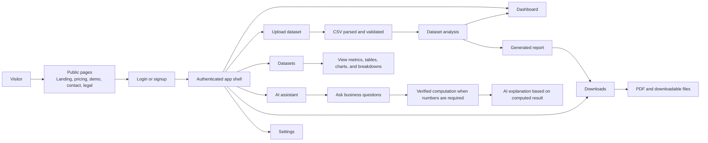
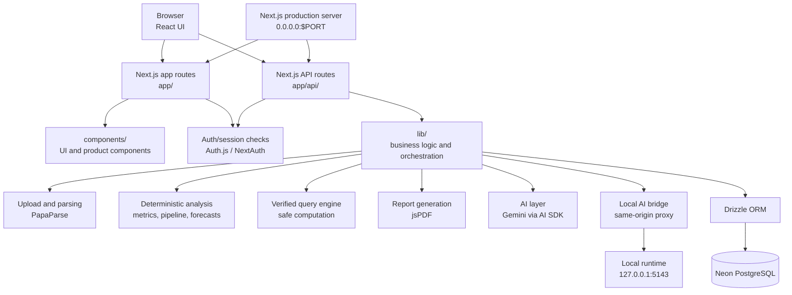
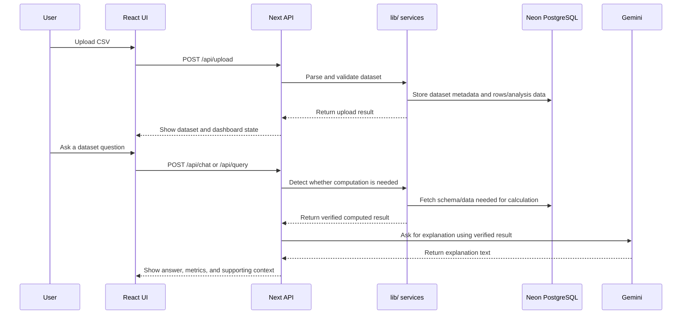

# Developer Guide

Complete guide to developing, testing, and deploying the UseClevr application.

---

1. [Setup & Requirements](#setup--requirements)
2. [Application Architecture](#application-architecture)
3. [Deployment](#deployment)

---

## Table of Contents

1. [Setup & Requirements](#setup--requirements)
2. [Application Architecture](#application-architecture)
3. [Deployment](#deployment)

---

## Setup & Requirements

### Quick Setup

```bash
# Install dependencies
pnpm install

# Configure environment
cp .env.local.example .env.local

# Start development server
pnpm dev
```

### Requirements

- Node.js 22+
- pnpm 10+
- Neon PostgreSQL
- Gemini API key

### Environment Variables

**Required:**
```env
DATABASE_URL=
DIRECT_URL=
AUTH_SECRET=
GEMINI_API_KEY=
```

**Optional:**
- `PORT` — Local dev port
- `AUTH_URL` — Auth URL override
- `LOCAL_UPLOAD_DIR` — Runtime upload path
- `LOCAL_UPLOAD_URL` — Runtime upload URL prefix
- `UPLOAD_PROVIDER` — Storage provider (`s3` or `r2`)

### Database

Neon PostgreSQL configuration:

| Field | Value |
| --- | --- |
| Project ID | `withered-star-79790747` |
| Branch ID | `br-crimson-sun-ai49oqj4` |
| Database | `neondb` |
| Role | `neondb_owner` |

**Commands:**
```bash
pnpm db:push    # Sync schema
pnpm db:migrate # Run migrations
pnpm db:studio  # Open Drizzle Studio
```

**Key Files:**
- `lib/db/schema.ts`
- `lib/db/index.ts`
- `lib/db/migrations/`

### Production Build

```bash
pnpm prod:build  # Output: dist/server.js, dist/.next/, dist/assets/
pnpm prod:start
```

### Troubleshooting

| Issue | Check |
| --- | --- |
| AI fails | `GEMINI_API_KEY`, restart server |
| Auth fails | `AUTH_SECRET`, optional `AUTH_URL` |
| DB fails | `DATABASE_URL`, `DIRECT_URL`, Neon SSL |
| Railway fails | env vars, `/api/health`, `railway.json` |

---

---

## Verified Computation & Pipeline

Prevents AI from inventing numbers by routing numeric questions through validated computation. The AI serves as an explanation layer, while deterministic logic produces the actual computed results.

### Deterministic Pipeline Flow

```text
CSV upload
  -> parse rows
  -> normalize columns
  -> detect business fields
  -> compute KPIs/segments/forecasts
  -> store or return verified data
  -> AI explains verified data
```

### Rules

| Rule | Reason |
| --- | --- |
| Compute numbers in TypeScript/query logic | Prevent numeric hallucinations |
| Treat AI as explanation layer | AI is not source of truth for metrics |
| Keep schema/column mapping explicit | Avoid wrong column assumptions |
| Return provenance where possible | Make answers auditable |
| Fail clearly when data is missing | Avoid fake confidence |

### Key Files

| Area | Files |
| --- | --- |
| CSV/data analysis | `lib/csv-analyzer.ts`, `lib/dataset-analyzer.ts`, `lib/full-analysis-engine.ts` |
| Pipeline | `lib/pipeline-orchestrator.ts`, `lib/pipeline-types.ts`, `lib/pipeline/` |
| Column mapping | `lib/column-mapper.ts`, `lib/business-columns.ts`, `lib/dataset-type-detector.ts` |
| Forecasting | `lib/forecast/`, `lib/forecast.ts` |
| Query/verified computation | `lib/queryEngine.ts`, `lib/queryIntentPrompt.ts`, `app/api/query/route.ts` |
| AI explanation | `app/api/chat/route.ts`, `lib/llmAdapter.ts`, `lib/ai-*` |

### Query Engine - Runtime Flow

```text
question
  -> detect computation need
  -> generate query intent
  -> validate operation/columns
  -> compute result
  -> ask AI to explain computed result
```

### Operations

| Operation | Validation |
| --- | --- |
| `count` | Dataset exists and user can access it |
| `count_distinct` | Column exists |
| `sum` | Column exists and is numeric |
| `avg` | Column exists and is numeric |
| `min` | Column exists and is numeric/date-compatible |
| `max` | Column exists and is numeric/date-compatible |
| `group_by` | Group and metric columns exist; metric is valid |
| `top_n` | Column exists; limit is bounded |

### Query API

**Endpoint:** `POST /api/query`

**Request:**
```json
{
  "datasetId": "string",
  "question": "string"
}
```

**Response:**
```json
{
  "success": true,
  "result": {
    "computed_value": 123,
    "operation": "sum",
    "column": "Revenue",
    "row_count": 1000,
    "execution_time_ms": 10
  },
  "explanation": "string"
}
```

### Tests

- Count rows
- Count distinct
- Sum numeric column
- Average numeric column
- Group by category
- Reject unknown column
- Reject numeric operation on text
- Reject unauthorized dataset access

### Manual Checks

```bash
pnpm dev
```

```bash
curl -X POST http://localhost:3000/api/query \
  -H "Content-Type: application/json" \
  -d '{"datasetId":"your-dataset-id","question":"What is the total revenue?"}'
```

**Expected:**
- Operation is explicit
- Column matches schema
- Result is computed
- Explanation matches result

### Logs

```
[QueryEngine]
[CHAT] Question requires verified computation
[CHAT] Executing verified query
```

### Rollback

1. Set `DISABLE_VERIFIED_COMPUTATION=true` if supported
2. Confirm chat falls back
3. Revert chat/query route changes if needed

### Common Issues

| Issue | Check |
| --- | --- |
| Dataset not found | Dataset ID and user/workspace scope |
| Column not found | Generated name vs stored schema |
| Column not numeric | Use numeric column for numeric operations |
| Timeout | Dataset size, query complexity, timeout |
| AI changes number | Final prompt must treat computed result as source of truth |

---

## Application Architecture

### User-Facing Chart

Product journey from a user's point of view.



### Responsibilities

| Area | Understanding |
| --- | --- |
| Public pages | Product, pricing, demo, legal, contact, security. |
| Authentication | Moves users from public to protected area. |
| Upload | Accepts CSV, starts parsing, validation, analysis. |
| Dashboard | KPIs, charts, breakdowns, forecasts, reports. |
| Datasets | View uploaded data and insights. |
| Assistant | Answers questions; delegates numeric answers to verified computation. |
| Reports/downloads | Generates and serves PDF/report files. |
| Settings | Account/profile configuration and preferences. |

### Production Technical Chart

Production internals and system cooperation.



### Layer Responsibilities

| Layer | Files/Folders | Responsibility |
| --- | --- | --- |
| Frontend routes | `app/`, `app/app/` | Public pages and authenticated screens. |
| API routes | `app/api/` | Upload, chat, query, reports, datasets, forecast, local AI, health. |
| UI components | `components/`, `components/ui/` | Shared product UI, layouts, upload controls, data views, chat, reports. |
| Business logic | `lib/` | Data processing, AI orchestration, deterministic metrics, forecasts, storage, permissions. |
| Database | `lib/db/` | Drizzle schema, Neon connection setup, migrations. |
| Verified computation | `lib/queryEngine.ts`, `lib/queryIntentPrompt.ts`, `app/api/query/route.ts` | Converts computational questions into validated operations. |
| AI analysis | `lib/ai-*`, `lib/llmAdapter.ts`, `app/api/chat/route.ts` | Generates analysis while avoiding unsupported numeric claims. |
| Reports | `lib/report-generator.ts`, `lib/pdf-report-generator.ts`, `app/api/reports/route.ts` | Builds report content and downloadable PDF output. |
| Local AI | `lib/local-agent.ts`, `app/api/local-ai-*`, `app/api/local-agent/contract.md` | Connects app to local runtime for local AI features. |

### Data and AI Sequence



---

## Deployment

Railway deployment with Docker and GitHub Actions CI/CD.

### Flow

```mermaid
flowchart LR
    Dev[Change] --> Git[GitHub]
    Git --> Railway[Railway]
    Railway --> Build[Docker build]
    Build --> Deploy[Deploy container]
    Deploy --> Health[/api/health]
    Deploy --> App[Production app]
    App --> Neon[(Neon)]
```

### Steps

| Step | Role |
| --- | --- |
| GitHub | Code and deployment triggers |
| Railway | Builds Docker image, runs container, health checks |
| Docker | Container runtime |
| Next.js server | Serves pages and APIs |
| `/api/health` | Health check endpoint |
| Neon | Production database |

### Railway

#### Environment

**Required:**
```env
DATABASE_URL=
DIRECT_URL=
AUTH_SECRET=
GEMINI_API_KEY=
```

**Optional:**
```env
AUTH_URL=
TRUST_PROXY=true
LOCAL_UPLOAD_DIR=/tmp/useclevr-uploads
UPLOAD_PROVIDER=
```

#### Checklist

- Dockerfile uses `node:22` or newer
- Start command binds to `0.0.0.0`
- App uses Railway `$PORT`
- `/api/health` returns 200 quickly
- No secrets in Docker image or logs
- Uploads validate type and size
- Security headers enabled in `next.config.mjs`

#### Debug

```bash
railway logs
railway status
railway open
```

Common issues:

- missing env vars
- port not bound to `0.0.0.0`
- database connection
- health timeout
- leaked secrets

#### Incidents

1. Rotate secrets
2. Check Railway variables and logs
3. Confirm deployed commit
4. Disable affected route if needed
5. Patch, redeploy, verify `/api/health`

### GitHub Actions

Runs checks before deployment.

#### Checks

```bash
pnpm install --frozen-lockfile
pnpm build
pnpm exec tsc --noEmit
pnpm audit
```

#### Secrets

Only add if workflows need Railway CLI:

```
RAILWAY_TOKEN
RAILWAY_PROJECT_ID
```

Keep app runtime secrets in Railway.

#### PR Expectations

- Install, build, TypeScript pass
- Security audit visible
- Workflow checks are short and actionable

#### Triage

| Failure | Check |
| --- | --- |
| Install | pnpm version, lockfile, Node version |
| Build | Next.js errors, missing env stubs, asset paths |
| TypeScript | Existing issues vs new errors |
| Railway deploy | Railway logs and `railway.json` |

---

---

## Testing & Verification

### Quick Checks

```bash
pnpm build
pnpm exec tsc --noEmit
pnpm db:studio
curl http://localhost:3000/api/health
```

### Smoke Tests

1. Run `pnpm dev`
2. Open the public home page
3. Sign in or create a test account
4. Upload a sample CSV
5. Confirm dashboard KPIs and charts render
6. Ask a dataset question in the assistant
7. Generate or download a report

### Verified Computation Checks

See the [Query Engine](#query-engine) section above for query tests.

### Deployment Checks

1. Confirm Railway environment variables are set
2. Confirm `/api/health` responds after deployment
3. Confirm the app binds to Railway `$PORT`
4. Review Railway logs for build or runtime errors
