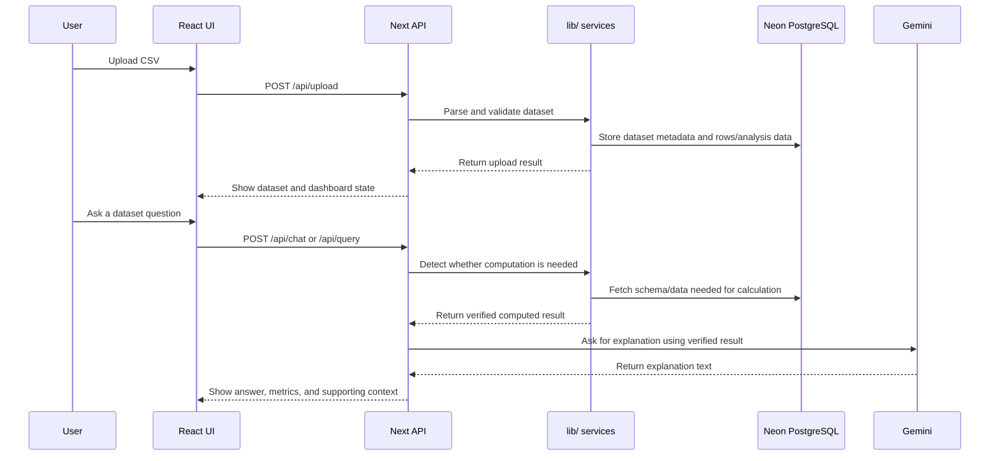

# Developer Guide

## Setup

```bash
pnpm install
cp .env.local.example .env.local
pnpm dev
```

## Requirements

- Node.js 22+
- pnpm 10+
- Neon PostgreSQL
- Gemini API key

## Lib Structure

```
src/lib/
├── ai/          # AI and LLM helpers
├── data/        # Dataset parsing, cleaning, and analysis
├── query/       # Query intent, validation, and execution
├── business/    # Business logic and metric mapping
├── db/          # Database schema and runtime helpers
├── auth/        # Authentication and permissions
├── billing/     # Billing and subscriptions
├── reports/     # Reporting logic and exports
├── usage/       # Usage tracking and credit accounting
├── referrals/   # Referral flow helpers
├── mcp/         # MCP integration
└── utils/       # Shared helpers and utilities
```

## Env

Required:
```env
DATABASE_URL=
DIRECT_URL=
AUTH_SECRET=
GEMINI_API_KEY=
```

Optional:
- `PORT`
- `AUTH_URL`
- `LOCAL_UPLOAD_DIR`
- `LOCAL_UPLOAD_URL`
- `UPLOAD_PROVIDER`

## Database

Neon config:
- Project ID: `withered-star-79790747`
- Branch ID: `br-crimson-sun-ai49oqj4`
- Database: `neondb`
- Role: `neondb_owner`

Commands:
```bash
pnpm db:push
pnpm db:migrate
pnpm db:studio
```

Key files:
- `lib/db/schema.ts`
- `lib/db/index.ts`
- `lib/db/migrations/`

## Production

```bash
pnpm ci:railway
pnpm prod:build
pnpm prod:start
```

- Deploy root: `dist`
- Commit `dist/railway.json`
- Template: `ci-settings/railway.dist.json`

## Troubleshooting

| Issue | Fix |
| --- | --- |
| AI fail | `GEMINI_API_KEY`, restart |
| Auth fail | `AUTH_SECRET`, `AUTH_URL` |
| DB fail | `DATABASE_URL`, `DIRECT_URL`, SSL |
| Railway fail | env vars, `/api/health`, `dist/railway.json` |

## Verified computation

Compute metrics in code, use AI only for explanation.

Key files:
- `lib/queryEngine.ts`
- `lib/queryIntentPrompt.ts`
- `app/api/query/route.ts`
- `app/api/chat/route.ts`
- `lib/llmAdapter.ts`

Query endpoint: `POST /api/query`
Request:
```json
{"datasetId":"string","question":"string"}
```
Response:
```json
{"success":true,"result":{"computed_value":123,"operation":"sum","column":"Revenue","row_count":1000,"execution_time_ms":10},"explanation":"string"}
```

Validation rules:
- `count`, `count_distinct`, `sum`, `avg`, `min`, `max`, `group_by`, `top_n`
- Column exists and type matches operation
- Dataset access is authorized

## Quick checks

```bash
pnpm dev
```

```bash
curl -X POST http://localhost:3000/api/query -H "Content-Type: application/json" -d '{"datasetId":"your-dataset-id","question":"What is the total revenue?"}'
```

Expected:
- explicit operation
- computed result
- explanation matches result


```mermaid
sequenceDiagram
    participant User
    participant UI as React UI
    participant API as Next API
    participant Lib as lib/ services
    participant DB as Neon PostgreSQL
    participant AI as Gemini

    User->>UI: Upload CSV
    UI->>API: POST /api/upload
    API->>Lib: Parse and validate dataset
    Lib->>DB: Store dataset metadata and rows/analysis data
    Lib-->>API: Return upload result
    API-->>UI: Show dataset and dashboard state

    User->>UI: Ask a dataset question
    UI->>API: POST /api/chat or /api/query
    API->>Lib: Detect whether computation is needed
    Lib->>DB: Fetch schema/data needed for calculation
    Lib-->>API: Return verified computed result
    API->>AI: Ask for explanation using verified result
    AI-->>API: Return explanation text
    API-->>UI: Show answer, metrics, and supporting context
```

---

## Deployment

Railway deployment with Docker and GitHub Actions CI/CD.

### Flow

```mermaid
flowchart LR
    Dev[Change] --> Git[GitHub]
    Git --> Railway[Railway]
    Railway --> Build[Docker build]
    Build --> Deploy[Deploy container]
    Deploy --> Health[/api/health]
    Deploy --> App[Production app]
    App --> Neon[(Neon)]
```

### Steps

| Step | Role |
| --- | --- |
| GitHub | Code and deployment triggers |
| Railway | Builds Docker image, runs container, health checks |
| Docker | Container runtime |
| Next.js server | Serves pages and APIs |
| `/api/health` | Health check endpoint |
| Neon | Production database |

### Railway

Railway root is `dist`.

Commit `dist/railway.json`. Railway reads it before build.

Refresh it with `pnpm ci:railway`.

#### Environment

**Required:**
```env
DATABASE_URL=
DIRECT_URL=
AUTH_SECRET=
GEMINI_API_KEY=
```

**Optional:**
```env
AUTH_URL=
TRUST_PROXY=true
LOCAL_UPLOAD_DIR=/tmp/useclevr-uploads
UPLOAD_PROVIDER=
```

#### Checklist

- Dockerfile uses `node:22` or newer
- Start command binds to `0.0.0.0`
- App uses Railway `$PORT`
- `/api/health` returns 200 quickly
- `dist/railway.json` exists in git
- No secrets in Docker image or logs
- Uploads validate type and size
- Security headers enabled in `next.config.mjs`

#### Debug

```bash
railway logs
railway status
railway open
```

Common issues:

- missing env vars
- port not bound to `0.0.0.0`
- database connection
- health timeout
- leaked secrets

#### Incidents

1. Rotate secrets
2. Check Railway variables and logs
3. Confirm deployed commit
4. Disable affected route if needed
5. Patch, redeploy, verify `/api/health`

### GitHub Actions

Runs checks before deployment.

#### Checks

```bash
pnpm install --frozen-lockfile
pnpm build
pnpm exec tsc --noEmit
pnpm audit
```

#### Secrets

Only add if workflows need Railway CLI:

```
RAILWAY_TOKEN
RAILWAY_PROJECT_ID
```

Keep app runtime secrets in Railway.

#### PR Expectations

- Install, build, TypeScript pass
- Security audit visible
- Workflow checks are short and actionable

#### Triage

| Failure | Check |
| --- | --- |
| Install | pnpm version, lockfile, Node version |
| Build | Next.js errors, missing env stubs, asset paths |
| TypeScript | Existing issues vs new errors |
| Railway deploy | Railway logs, `dist/railway.json`, `ci-settings/railway.dist.json` |

---

---

## Testing & Verification

### Quick Checks

```bash
pnpm build
pnpm exec tsc --noEmit
pnpm db:studio
curl http://localhost:3000/api/health
```

### Smoke Tests

1. Run `pnpm dev`
2. Open the public home page
3. Sign in or create a test account
4. Upload a sample CSV
5. Confirm dashboard KPIs and charts render
6. Ask a dataset question in the assistant
7. Generate or download a report

### Verified Computation Checks

See the [Query Engine](#query-engine) section above for query tests.

### Deployment Checks

1. Confirm Railway environment variables are set
2. Confirm `/api/health` responds after deployment
3. Confirm the app binds to Railway `$PORT`
4. Review Railway logs for build or runtime errors
