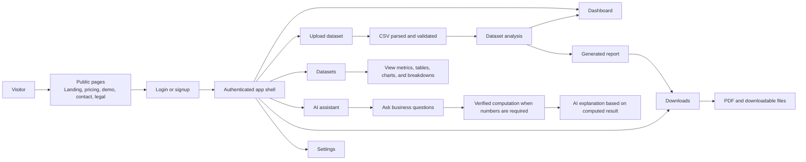

# User-Facing App Flow

This diagram shows the product journey from a user's point of view.

## User-Facing Responsibilities

| Area | What Team Members Should Understand |
| --- | --- |
| Public pages | Explain the product, pricing, demo, legal, contact, and security information. |
| Authentication | Moves users from public pages into the protected product area. |
| Upload | Accepts CSV/business datasets and starts parsing, validation, and analysis. |
| Dashboard | Presents KPIs, charts, breakdowns, forecasts, and report entry points. |
| Datasets | Lets users inspect uploaded data and generated insights. |
| Assistant | Answers dataset questions and delegates numeric answers to verified computation when needed. |
| Reports and downloads | Generates and serves PDF/report files for users. |
| Settings | Holds account/profile-level configuration and product preferences. |
