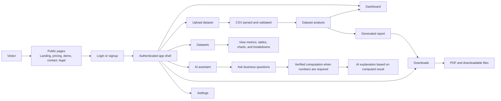
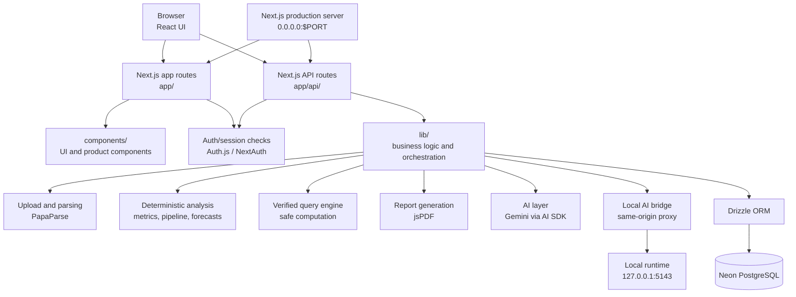
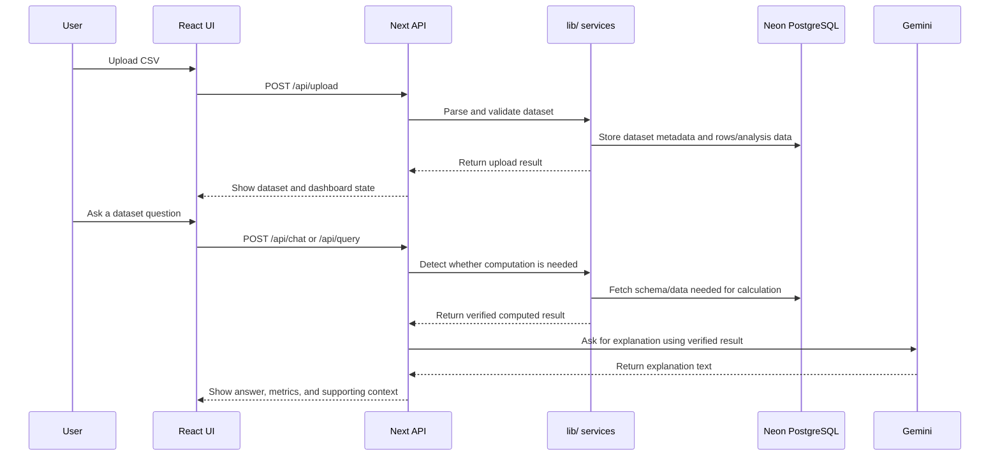

# Application Charts

## User-Facing Chart

Product journey from a user's point of view.

### Responsibilities

| Area | Understanding |
| --- | --- |
| Public pages | Product, pricing, demo, legal, contact, security. |
| Authentication | Moves users from public to protected area. |
| Upload | Accepts CSV, starts parsing, validation, analysis. |
| Dashboard | KPIs, charts, breakdowns, forecasts, reports. |
| Datasets | View uploaded data and insights. |
| Assistant | Answers questions; delegates numeric answers to verified computation. |
| Reports/downloads | Generates and serves PDF/report files. |
| Settings | Account/profile configuration and preferences. |

## Production Technical Chart

Production internals and system cooperation.

### Layer Responsibilities

| Layer | Files/Folders | Responsibility |
| --- | --- | --- |
| Frontend routes | `app/`, `app/app/` | Public pages and authenticated screens. |
| API routes | `app/api/` | Upload, chat, query, reports, datasets, forecast, local AI, health. |
| UI components | `components/`, `components/ui/` | UI, layouts, upload, data views, chat, reports. |
| Business logic | `lib/` | Data processing, AI orchestration, metrics, forecasts, storage, permissions. |
| Database | `lib/db/` | Drizzle schema, Neon connections, migrations. |
| Verified computation | `lib/queryEngine.ts`, `lib/queryIntentPrompt.ts`, `app/api/query/route.ts` | Converts computational questions into validated operations. |
| AI analysis | `lib/ai-*`, `lib/llmAdapter.ts`, `app/api/chat/route.ts` | Generates analysis while avoiding unsupported numeric claims. |
| Reports | `lib/report-generator.ts`, `lib/pdf-report-generator.ts`, `app/api/reports/route.ts` | Builds report content and PDF output. |
| Local AI | `lib/local-agent.ts`, `app/api/local-ai-*`, `app/api/local-agent/contract.md` | Connects app to local runtime for local AI features. |

### Data and AI Sequence

### User-Facing Responsibilities

| Area | What Team Members Should Understand |
| --- | --- |
| Public pages | Explain the product, pricing, demo, legal, contact, and security information. |
| Authentication | Moves users from public pages into the protected product area. |
| Upload | Accepts CSV/business datasets and starts parsing, validation, and analysis. |
| Dashboard | Presents KPIs, charts, breakdowns, forecasts, and report entry points. |
| Datasets | Lets users inspect uploaded data and generated insights. |
| Assistant | Answers dataset questions and delegates numeric answers to verified computation when needed. |
| Reports and downloads | Generates and serves PDF/report files for users. |
| Settings | Holds account/profile-level configuration and product preferences. |

## Production Technical Flow

This diagram shows the production application internals and how the main systems cooperate behind the scenes.

### Technical Responsibilities

| Layer | Main Files/Folders | Responsibility |
| --- | --- | --- |
| Frontend routes | `app/`, `app/app/` | Public pages and authenticated product screens. |
| API routes | `app/api/` | Server endpoints for upload, chat, query, reports, datasets, forecast, local AI, and health checks. |
| UI components | `components/`, `components/ui/` | Shared product UI, layouts, upload controls, data views, chat, and report interactions. |
| Business logic | `lib/` | Data processing, AI orchestration, deterministic metrics, forecasts, storage, permissions, and utilities. |
| Database | `lib/db/` | Drizzle schema, Neon connection setup, and migrations. |
| Verified computation | `lib/queryEngine.ts`, `lib/queryIntentPrompt.ts`, `app/api/query/route.ts` | Converts computational questions into validated operations and returns computed results. |
| AI analysis | `lib/ai-*`, `lib/llmAdapter.ts`, `app/api/chat/route.ts` | Generates natural-language analysis while avoiding unsupported numeric claims. |
| Reports | `lib/report-generator.ts`, `lib/pdf-report-generator.ts`, `app/api/reports/route.ts` | Builds report content and downloadable PDF output. |
| Local AI | `lib/local-agent.ts`, `app/api/local-ai-*`, `app/api/local-agent/contract.md` | Connects the app to a local runtime for local AI features. |

### Data And AI Sequence

