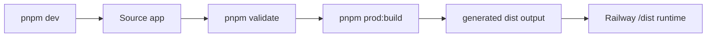

# Package Json And Pnpm Usage

## Table Of Contents

- [Command Flow](#command-flow)
- [Script Groups](#script-groups)
- [Dependency Checks](#dependency-checks)
- [Package Rules](#package-rules)
- [Script Modules](#script-modules)
- [Related Docs](#related-docs)

This project uses `pnpm` through Corepack. Use `pnpm` for local development, CI parity, and generated
deployment output.

## Command Flow

## Script Groups

| Group           | Scripts                                                   | Purpose                                      |
| --------------- | --------------------------------------------------------- | -------------------------------------------- |
| Development     | `pnpm dev`, `pnpm dev:frontend`, `pnpm dev:server`        | Start the local Next.js app.                 |
| Build           | `pnpm build`, `pnpm prod:build`, `pnpm preview`           | Build source or generated deployment output. |
| Validation      | `pnpm validate`, `pnpm validate:prepush`, `pnpm health` | Run local and CI gates.                      |
| Deploy config   | `pnpm deploy:railway:check`, `pnpm deploy:vercel:check`   | Validate host config templates.              |
| Lint and format | `pnpm lint`, `pnpm lint:fix`, `pnpm format:check`         | Check source, package, TODO, and formatting. |
| Database        | `pnpm db:generate`, `pnpm db:migrate`, `pnpm db:push`     | Manage Drizzle schema changes.               |

## Dependency Checks

`pnpm lint` runs package metadata checks, TODO metadata checks, workflow checks, secret-leak checks, pricing validation, and ESLint.

`pnpm lint:docs`, `pnpm lint:changelog`, `pnpm lint:commits`, and `pnpm link:docs` are separate
targeted checks so developers can run only the surface they changed.

`pnpm lint:deps` runs `pnpm outdated`. It is intentionally not part of `validate:prepush` because it
checks external release availability and can fail or change independently of the local code change.

Use `pnpm lint:all` when you want source lint plus dependency freshness in one manual pass.

## Package Rules

- Keep `packageManager` aligned with Corepack usage in deployment docs.
- Keep `lint:deps` manual and outside `validate:prepush`.
- Keep runtime export dependencies in `dependencies`; generated Railway output installs production
  dependencies only.
- Keep build, lint, docs, and release tooling in `devDependencies`.
- Update [TECH_DEPENDENCIES.md](TECH_DEPENDENCIES.md) when dependency versions or usage categories
  change.

## Script Modules

Source-side maintenance scripts use ESM because the repository package is `type: module`. Runtime
preload/start helpers and CommonJS-only tooling entrypoints keep `.cjs` so Node can load them through
`node -r` and generated deployment packages can start predictably.

Use `scripts/lib/app-config.js` from ESM scripts and `scripts/lib/app-config.cjs` from CommonJS
scripts when a script needs repository paths or the pinned package-manager setting.

## Related Docs

- [Technical Dependencies](TECH_DEPENDENCIES.md)
- [Railway Deployment](RAILWAY_DEPLOYMENT.md)
- [Vercel Deployment](VERCEL_DEPLOYMENT.md)
