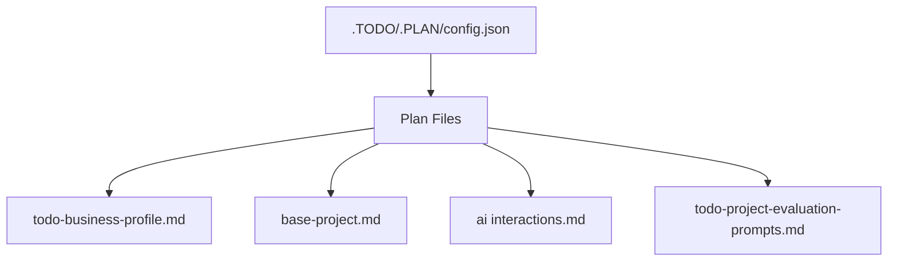

# Plan Management

## Table Of Contents

- [Overview](#overview)
- [Prefix System](#prefix-system)
- [Files](#files)
- [How To Add Plans](#how-to-add-plans)
- [Completion Rules](#completion-rules)

This repository tracks plans in `.TODO/.PLAN/`. `.TODO/.PLAN/config.json` owns plan numbering and general settings.

---

## Overview

---

## Prefix System

| Prefix | Usage          | Markdown Level | Example      |
|--------|----------------|----------------|--------------|
| P-     | Phase          | ##             | P-1 Overview |
| S-     | Stage          | ###            | S-1 Features |
| T-     | Suggestion Task| [suggestions]  | T-275 Task   |
| L-     | List Item      | Unordered list | L-1 Item     |
| U-     | Group          | ####           | U-1 Details  |

---

## Files

| File                           | Purpose                                        |
| ------------------------------ | ---------------------------------------------- |
| `.TODO/.PLAN/config.json`      | General plan settings and counter management   |
| `todo-business-profile.md`     | Business profile feature plan                  |
| `base-project.md`              | Base project stripping plan                    |
| `ai interactions.md`           | AI interaction guidelines                      |
| `todo-project-evaluation.md`   | Project evaluation prompts                     |

---

## How To Add Plans

1. Read `.TODO/.PLAN/config.json` for current counter values
2. Assign P- prefix for phase headers (##)
3. Assign S- prefix for stage headers (###)
4. Assign U- prefix for group headers (####)
5. Add suggestions as T-numbers in [suggestions] section
6. Move completed suggestions to TODO system as T-tasks

---

## Completion Rules

- Plans that are fully implemented get `[IMPLEMENTED]` marker
- Update related TODO items and changelog when plans are completed
- Keep plan files focused on single features or concepts
- Use Mermaid diagrams for flows and architecture
