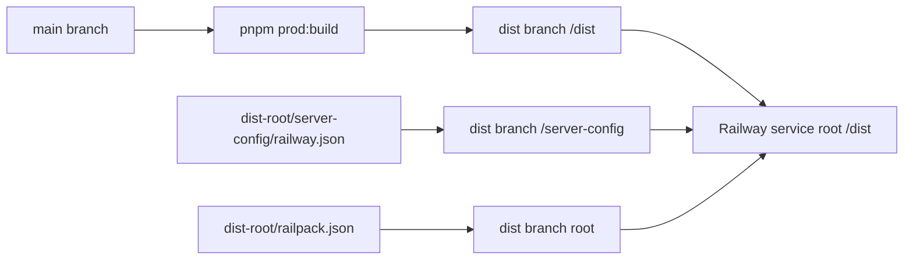

# Railway Deployment

## Table Of Contents

- [Railway Settings](#railway-settings)
- [Build Shape](#build-shape)
- [Runtime Commands](#runtime-commands)
- [Railway CLI](#railway-cli)
- [Local Checks](#local-checks)
- [Troubleshooting](#troubleshooting)

Railway deploys generated production output from the `dist` branch.

Railway test deploy review uses the `beta` source branch and `dist-test` deployment branch. Keep
test deploy checks away from `main`, `dist`, and the live app unless a task explicitly changes scope.

## Railway Settings

- Branch: `dist`
- Root directory: `/dist`
- Config file path: `/server-config/railway.json`
- Builder: Railpack

Leave Railway dashboard build, pre-deploy, and start command overrides empty unless debugging a
temporary incident. The config file owns those commands.

## Build Shape



GitHub Actions builds the app from `main`, publishes generated output to `/dist` on the `dist`
branch, and publishes Railway config to `/server-config/railway.json` on the same branch.

`dist-root/server-config/railway.json` controls deploy with a prebuilt `/dist`. The build command
outputs `"echo prebuilt"` since GitHub Actions publishes generated output directly to `/dist`.

`dist-root/railpack.json` declares the Node.js provider and skips dependency installation — the
standalone bundle includes all production modules in `dist/node_modules/`.

The generated output intentionally does not include `pnpm-workspace.yaml`, `railway.json`, or
`vercel.json`.

## Runtime Commands

Railway config uses:

```bash
node ./scripts/runtime/railway-predeploy.cjs
sh start.sh
```

The predeploy command runs an idempotent additive schema sync for generated deployments. The start
script uses POSIX `sh` and then runs `node -r ./scripts/runtime/load-env.cjs
./scripts/runtime/start-dist.cjs`. The runtime helper binds to Railway `$PORT`, forces `0.0.0.0`,
and lets Auth.js infer the active public host from Railway proxy headers.

## Railway CLI

Fastest safe local operator flow:

```bash
pnpm railway:login
pnpm railway:link -- --project <project-id-or-name> --environment <environment-id-or-name> --service <service-id-or-name>
pnpm railway:status
pnpm railway:logs
```

Trigger the latest deploy:

```bash
railway redeploy
```

If `redeploy` is unavailable in the installed CLI:

```bash
railway up
```

Use `pnpm dlx @railway/cli <command>` when Railway is not installed globally. CLI access requires a
browser login, browserless login, or a token in the shell environment.

`pnpm railway:login` uses `railway login --browserless`, which prints a pairing URL and code for
machines where the browser login flow is unavailable. Token auth does not log the CLI in; it only
authenticates the commands in the shell where the token is set.

Use `RAILWAY_TOKEN` for project-scoped commands in one project and environment. Use
`RAILWAY_API_TOKEN` for account or workspace-scoped commands such as listing projects or linking
without an existing project token. Set only one of these variables in a shell. Keep tokens in the
local shell or ignored env files, and never commit them.

## Railpack Configuration

Railpack uses `railpack.json` at the deployment root (the `dist` branch root, not inside `/dist`).
The config declares only the Node.js provider — no custom install/build steps:

```json
{
  "provider": "node"
}
```

- `provider` must be a singular string (`"node"`), not a plural array (`["node"]`) — the plural form
  is silently ignored by Railpack.
- Custom `install`/`build` steps were removed because they prevent Railpack from setting up the
  Node.js runtime, causing `node: command not found` at deploy time.
- Railpack's default npm install is instant because `dist/package.json` has empty `dependencies: {}`.
  The real production modules are bundled in `dist/node_modules/` from `.next/standalone`.

## Node Modules in Dist Output

`dist/node_modules/` (33MB, pnpm symlink structure via `.pnpm/`) is committed to the `dist` branch.
Railpack needs `node_modules` present in the source for its build graph checksum calculation.
Without it, Railway fails with:

```
failed to calculate checksum of ref ...: "/app/node_modules": not found
```

Key requirements:
- `node_modules/` must NOT appear in any `.gitignore` that applies to the `dist` branch.
- The symlink structure must be relative, not absolute. Use `cp -a` (not `fs.cpSync`) when copying
  the standalone output — Node.js `fs.cpSync` resolves relative symlinks to absolute paths, which
  breaks the pnpm structure on Railway.

## Local Checks

```bash
pnpm validate:dist
pnpm prod:build
test ! -f dist/pnpm-workspace.yaml
test ! -f dist/pnpm-lock.yaml
test -f dist/package-lock.json  # minimal lockfile for Railpack npm detection
test ! -f dist/railway.json
test ! -f dist/vercel.json
test -f dist/node_modules/.pnpm  # node_modules must be present
test -f dist/railpack.json
```

## Troubleshooting

### Build Phase Failures

If Railway logs show `RUN npm i`, Railpack did not activate pnpm from the generated deployment
package or Railway is building the wrong root directory. Confirm Railway uses branch `dist`, root
directory `/dist`, and config file path `/server-config/railway.json`.

If logs show workspace metadata errors, confirm generated `/dist` does not contain
`pnpm-workspace.yaml` and the deployment branch root does not contain `pnpm-workspace.yaml`.

If logs show pnpm requiring a newer Node release, keep the deployment package on a pnpm version that
matches Railway's current Node runtime until Railway moves past the requirement.

If Railpack starts a dependency install for the test deploy, confirm the `dist-test` branch contains
only the minimal npm lockfile inside `/dist`. The standalone bundle includes production modules, and
the generated deployment package must not include pnpm workspace metadata.

If logs show `ERR_PNPM_NO_LOCKFILE`, keep Railway runtime installs on `--no-frozen-lockfile` because
the generated deployment package is smaller than the source workspace and Railway installs from
generated output only.

If logs show `failed to calculate checksum of ref ... "/app/node_modules": not found`:
- `node_modules/` is missing from the deployed branch.
- Check `.gitignore` on the deployment branch — `node_modules/` must not be ignored.
- Check the publish workflow — cleanup steps must not `rm -rf node_modules`.
- Regenerate dist output with `pnpm prod:build` and republish.

### Runtime Errors (502 / Healthcheck Failures)

If Railway deploys successfully but the app returns 502:
1. Check Railway logs for server startup errors or crash traces.
2. Verify `DATABASE_URL` and `AUTH_SECRET` are set in Railway environment variables.
3. Confirm the generated start command is `sh start.sh`, with no dashboard start override.
4. Confirm the database is reachable — Railway Postgres may require SSL:
   - The `pg` Pool in `src/lib/db/index.ts` uses `{ connectionString: url, max: 10 }` without SSL.
   - Add `ssl: { rejectUnauthorized: false }` when the hostname contains `railway.app` or `neon.tech`.
5. Check `/api/health` JSON for `database: "ready"` after startup:
   - Railway receives HTTP 200 from the liveness healthcheck while database readiness is reported in
     the response body.
   - Use `POST /api/health` for a strict readiness check that returns 503 while the database is not
     ready.

If the test app redirects to the live app host, remove fixed auth host variables from the Railway
test service or set `USECLEVR_AUTH_URL_STRICT=true` only when a single fixed callback host is
required. The default Railway runtime trusts the request host so `test.useclevr.com` stays on the test
service.

If runtime logs show `Could not find a production build in the './.next' directory`, keep the
generated `next-build` folder and the runtime restore step. Railway can omit dot-directories from the
service snapshot, while Next still expects `.next` at runtime.
