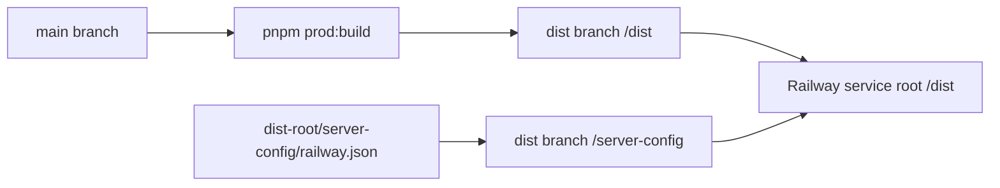

# Railway Deployment

## Table Of Contents

- [Railway Settings](#railway-settings)
- [Build Shape](#build-shape)
- [Runtime Commands](#runtime-commands)
- [Railway CLI](#railway-cli)
- [Local Checks](#local-checks)
- [Troubleshooting](#troubleshooting)

Railway deploys generated production output from the `dist` branch.

## Railway Settings

- Branch: `dist`
- Root directory: `/dist`
- Config file path: `/server-config/railway.json`
- Builder: Railpack

Leave Railway dashboard build, pre-deploy, and start command overrides empty unless debugging a
temporary incident. The config file owns those commands.

## Build Shape



GitHub Actions builds the app from `main`, publishes generated output to `/dist` on the `dist`
branch, and publishes Railway config to `/server-config/railway.json`.

`dist-root/server-config/railway.json` controls install via `preDeployCommand` and `startCommand`.

The generated output intentionally does not include `pnpm-workspace.yaml`, `railway.json`, or
`vercel.json`.

## Runtime Commands

Railway config uses:

```bash
pnpm run railway:predeploy
pnpm run start:railway
```

The predeploy command runs an idempotent additive schema sync for generated deployments. The start
command binds to Railway `$PORT` and forces `0.0.0.0` through the runtime helper, even when the host
injects its own `HOSTNAME` value.

## Railway CLI

Fastest safe operator flow:

```bash
railway login
railway link
railway status
railway logs
```

Trigger the latest deploy:

```bash
railway redeploy
```

If `redeploy` is unavailable in the installed CLI:

```bash
railway up
```

Use `pnpm dlx @railway/cli <command>` when Railway is not installed globally. CLI access requires a
browser login or `RAILWAY_TOKEN` in the shell environment.

## Local Checks

```bash
pnpm validate:dist
pnpm prod:build
test ! -f dist/pnpm-workspace.yaml
test ! -f dist/railway.json
test ! -f dist/vercel.json
```

## Troubleshooting

If Railway logs show `RUN npm i`, Railpack did not activate pnpm from the generated deployment
package or Railway is building the wrong root directory. Confirm Railway uses branch `dist`, root
directory `/dist`, and config file path `/server-config/railway.json`.

If logs show workspace metadata errors, confirm generated `/dist` does not contain
`pnpm-workspace.yaml` and the deployment branch root does not contain `pnpm-workspace.yaml`.

If logs show pnpm requiring a newer Node release, keep the deployment package on a pnpm version that
matches Railway's current Node runtime until Railway moves past the requirement.

If logs show `ERR_PNPM_NO_LOCKFILE`, keep Railway runtime installs on `--no-frozen-lockfile` because
the generated deployment package is smaller than the source workspace and Railway installs from
generated output only.

If runtime logs show `Could not find a production build in the './.next' directory`, keep the
generated `next-build` folder and the runtime restore step. Railway can omit dot-directories from the
service snapshot, while Next still expects `.next` at runtime.
