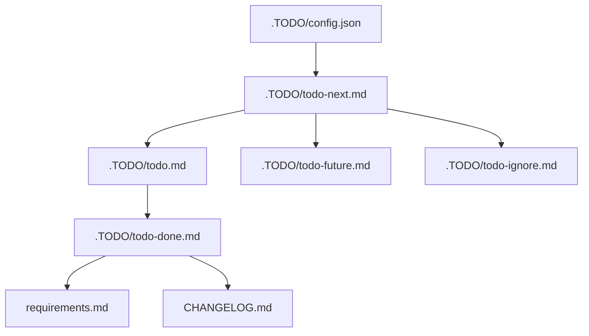

# TODO Management

## Table Of Contents

- [Flow](#flow)
- [Files](#files)
- [Task Numbering](#task-numbering)
- [How To Add Work](#how-to-add-work)
- [Completion Rules](#completion-rules)
- [Validation](#validation)
- [Dist Planning](#dist-planning)

This repository tracks active work in `.TODO/` files. `.TODO/config.json` owns numbered-task metadata
for agents and local validation.

## Flow



## Files

| File                        | Purpose                                                            |
| --------------------------- | ------------------------------------------------------------------ |
| `.TODO/config.json`         | Task numbering, tracked TODO file paths, and agent instructions.   |
| `.TODO/todo.md`             | Current leading-edge work and completed items waiting to be moved. |
| `.TODO/todo-next.md`        | Confirmed backlog that is ready to start.                          |
| `.TODO/todo-done.md`        | Durable completed work history.                                    |
| `.TODO/todo-future.md`      | Valid work that should wait.                                       |
| `.TODO/todo-ignore.md`      | Intentionally excluded work with rationale.                        |
| `.TODO/todo-dist.md`        | Active dist and deployment planning.                               |
| `.TODO/todo-dist-future.md` | Future dist and deployment ideas.                                  |
| `.TODO/todo-dist-done.md`   | Completed dist and deployment work.                                |
| `.TODO/todo-dist-no-fix.md` | Deliberate no-fix decisions with rationale.                        |

## Task Numbering

Use `.TODO/config.json` before adding numbered tasks:

1. Read `nextTaskNumber`.
2. Add one task per bullet using `currentTaskPrefix` and `taskIdPattern`.
3. Increase `nextTaskNumber` only when adding a new numbered task.
4. Do not reuse or renumber existing task IDs unless correcting a clear error.

Example:

- T126. Describe the shared config behavior for frontend and server build logic.

## How To Add Work

Add newly identified work to `.TODO/todo-next.md` unless the user asks to start it immediately. Keep
each item short, actionable, and tied to one outcome.

When work starts, move the active item into `.TODO/todo.md`. Do not leave stale in-progress entries
after the change is complete.

## Completion Rules

Completed items must update `.TODO/todo-done.md`. User-observable changes also update
`requirements.md`; user-visible release changes update `CHANGELOG.md` under `## [Unreleased]`.

Developer-only changes belong in the changelog `### Dev` section.

## Validation

```bash
pnpm lint:todos
```

The TODO checker validates `.TODO/config.json`, confirms configured files exist, checks task ID
format, and prevents duplicate task IDs across configured TODO files.

## Dist Planning

Dist and deployment planning stays in the dedicated dist TODO files. Do not duplicate those items in
the general TODO queue.
