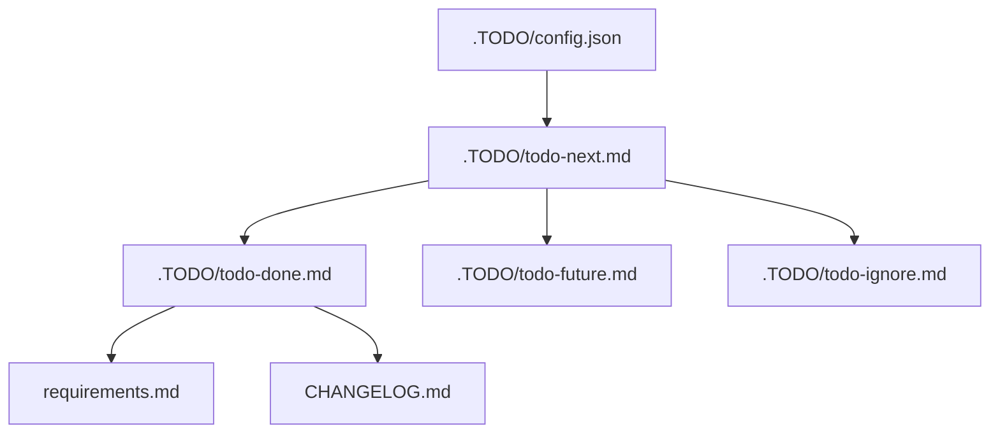

# TODO Management

## Table Of Contents

- [Flow](#flow)
- [Files](#files)
- [Task Numbering](#task-numbering)
- [How To Add Work](#how-to-add-work)
- [Completion Rules](#completion-rules)
- [Retirement And Temporary Branches](#retirement-and-temporary-branches)
- [Migration Record](#migration-record)
- [Validation](#validation)

This repository tracks work in `.TODO/`. `.TODO/config.json` owns task numbering, tracked TODO file
paths, and validation metadata.

## Flow



## Files

| File                   | Purpose                                                        |
| ---------------------- | -------------------------------------------------------------- |
| `.TODO/config.json`    | Task numbering, tracked TODO file paths, and agent rules.      |
| `.TODO/todo-next.md`   | The only active queue for confirmed work.                      |
| `.TODO/todo-done.md`   | Durable completed work history.                                |
| `.TODO/todo-future.md` | Valid work that should wait.                                   |
| `.TODO/todo-ignore.md` | Intentionally excluded work with rationale.                    |

Dist and audit-specific TODO files are retired. Dist follow-ups and audit findings now live in the
regular TODO files.

## Task Numbering

Use `.TODO/config.json` before adding tasks:

1. Read `nextTaskNumber`.
2. Add one task per bullet using the `T-` prefix, for example `T-244`.
3. Increase `nextTaskNumber` only when adding a new numbered task.
4. Do not reuse or renumber existing task IDs unless correcting a clear error.
5. Every task in the TODO files must have a `T-` number.

## How To Add Work

Add confirmed work to `.TODO/todo-next.md`. Use `.TODO/todo-future.md` for deferred work and
`.TODO/todo-ignore.md` for deliberate no-fix decisions.

Each TODO file starts with a short description and links to the other TODO files. Keep that header in
place when editing.

## Completion Rules

Move completed work to `.TODO/todo-done.md`. User-observable changes also update `requirements.md`;
release-facing changes update `CHANGELOG.md` under `## [Unreleased]`.

Developer-only changes belong in the changelog `### Dev` section.

## Retirement And Temporary Branches

Temporary TODO branches are allowed only while a focused migration or audit is actively being
processed. They must be short-lived and folded back into the four regular TODO files before the work
is considered complete.

Examples:

- A temporary deployment audit may start as `.TODO/todo-dist-temp.md`, then move completed items to
  `.TODO/todo-done.md`, deferred work to `.TODO/todo-future.md`, and no-fix decisions to
  `.TODO/todo-ignore.md`.
- A temporary security audit may start as `.TODO/todo-security-temp.md`, then move actionable work to
  `.TODO/todo-next.md` with `T-` numbers and convert repeatable process steps into a developer guide.

Retired TODO branches should not remain in `.TODO/config.json`. Keep the regular queues as the only
validated TODO files.

## Migration Record

The retired TODO files were:

- `.TODO/todo.md`
- `.TODO/todo-audit.md`
- `.TODO/todo-next-audit.md`
- `.TODO/todo-dist.md`
- `.TODO/todo-dist-done.md`
- `.TODO/todo-dist-future.md`
- `.TODO/todo-dist-no-fix.md`

Most old `todo-audit` tasks were retired into:

- `.TODO/todo-done.md` for completed documentation, static asset, dependency, flowchart, and setup work.
- `.TODO/todo-next.md` for active audit work covering API docs, security, production stability, code
  quality, performance, monitoring, billing, dependency drift, and test coverage.
- `PROJECT_AUDIT_GUIDE.md` for repeatable auditor workflow.
- `PROJECT_TESTING_GUIDE.md` for repeatable start-to-finish product testing.

The dist deployment succeeded, so completed deployment confirmations moved to `.TODO/todo-done.md`.
Remaining dist ideas moved to `.TODO/todo-future.md`, and deliberate no-fix decisions moved to
`.TODO/todo-ignore.md`.

## Validation

```bash
pnpm lint:todos
```

The TODO checker validates `.TODO/config.json`, confirms configured files exist, checks task ID
format, and prevents duplicate task IDs across configured TODO files.
