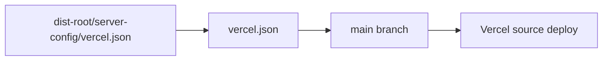

# Vercel Deployment

## Table Of Contents

- [Vercel Settings](#vercel-settings)
- [Commands](#commands)
- [Validation](#validation)
- [Troubleshooting](#troubleshooting)

Vercel deploys the source application from `main`.

## Vercel Settings



- Branch: `main`
- Root directory: `/`
- Config file: root `vercel.json`
- Framework: Next.js

The root `vercel.json` is synced from `dist-root/server-config/vercel.json`.

## Commands

The Vercel template uses Corepack pnpm:

```bash
corepack enable && corepack prepare pnpm@11.5.0 --activate && pnpm install --frozen-lockfile
pnpm build
pnpm dev
```

## Validation

```bash
pnpm deploy:vercel:sync
pnpm validate:dist
```

Do not point Vercel at the generated `dist` branch. Railway owns the generated-output deployment
path; Vercel owns source-branch builds.

## Troubleshooting

- If Vercel reads stale settings, run `pnpm deploy:vercel:sync` and confirm root `vercel.json`
  matches `dist-root/server-config/vercel.json`.
- If a Vercel build cannot install packages, confirm the project uses Corepack pnpm and the same Node
  major version as CI.
- If runtime secrets differ from Railway, update Vercel project environment variables directly; do
  not commit secrets to source.
