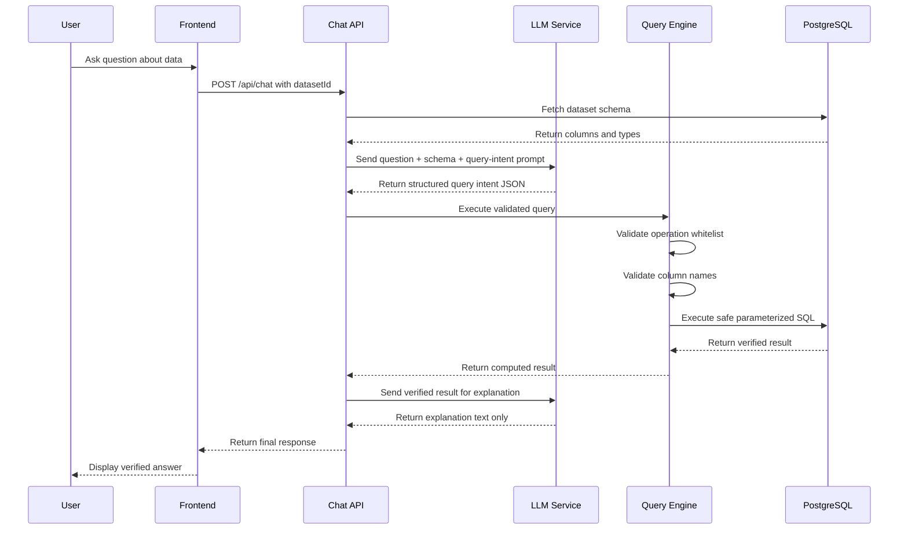
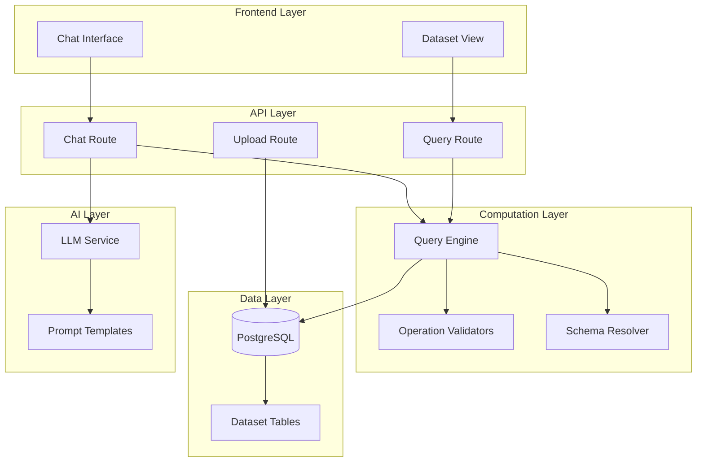

# Verified Computation Layer - Architecture Plan

## Executive Summary

This document outlines the implementation plan for a production-grade verified computation layer that ensures strict separation between LLM reasoning and actual data computation, eliminating numerical hallucinations in the UseClevr AI data analytics SaaS.

---

## Current Architecture Analysis

### Existing Components

| Component | Location | Current Role |
|-----------|----------|--------------|
| Database Schema | [`lib/db/schema.ts`](lib/db/schema.ts) | Drizzle ORM with PostgreSQL (Neon) |
| Chat Route | [`app/api/chat/route.ts`](app/api/chat/route.ts) | Handles AI conversations with pre-computed context |
| Upload Route | [`app/api/upload/route.ts`](app/api/upload/route.ts) | CSV parsing and storage |
| Analyze Route | [`app/api/datasets/[id]/analyze/route.ts`](app/api/datasets/[id]/analyze/route.ts) | Dataset analysis |
| CSV Analyzer | [`lib/csv-analyzer.ts`](lib/csv-analyzer.ts) | Deterministic CSV analysis |

### Current Problems

1. **LLM Computes Numbers**: The LLM receives sample data and may compute numbers directly
2. **No Query Validation**: No structured query intent validation
3. **Pre-computed Context Only**: Aggregated insights are pre-computed but not queryable dynamically
4. **No Operation Whitelist**: Any computation could potentially be requested

---

## Proposed Architecture

### System Flow Diagram



### Component Architecture



---

## Detailed Implementation Plan

### 1. PostgreSQL Schema Design

#### Option A: Dynamic Tables per Dataset (Recommended for Performance)

```sql
-- Master dataset registry
CREATE TABLE datasets (
    id TEXT PRIMARY KEY,
    user_id TEXT NOT NULL REFERENCES users(id),
    name VARCHAR(255) NOT NULL,
    file_name VARCHAR(255) NOT NULL,
    row_count INTEGER DEFAULT 0,
    column_count INTEGER DEFAULT 0,
    columns JSONB NOT NULL DEFAULT '[]',
    column_types JSONB,
    status VARCHAR(50) DEFAULT 'processing',
    created_at TIMESTAMP DEFAULT NOW(),
    updated_at TIMESTAMP DEFAULT NOW()
);

-- Dynamic table per dataset: dataset_{dataset_id}
-- Example: dataset_abc123
-- Columns dynamically created based on CSV structure
```

#### Option B: Unified Table with JSONB (Current Approach - Enhanced)

```sql
-- Keep existing structure but add computed values cache
ALTER TABLE datasets ADD COLUMN computed_cache JSONB DEFAULT '{}';
ALTER TABLE datasets ADD COLUMN schema_version INTEGER DEFAULT 1;
```

**Recommendation**: Use Option A for datasets with >1000 rows, Option B for smaller datasets.

### 2. Query Engine Module

**File**: [`lib/queryEngine.ts`](lib/queryEngine.ts)

```typescript
// Core interfaces
interface QueryIntent {
  operation: WhitelistedOperation;
  column?: string;
  columns?: string[];
  filter?: QueryFilter;
  groupBy?: string;
  orderBy?: string;
  limit?: number;
  aggregations?: AggregationSpec[];
}

type WhitelistedOperation = 
  | 'count'
  | 'count_distinct'
  | 'sum'
  | 'avg'
  | 'min'
  | 'max'
  | 'group_by'
  | 'top_n';

interface VerifiedResult {
  computed_value: number | Record<string, number>;
  column: string;
  operation: string;
  row_count?: number;
  execution_time_ms: number;
}

interface QueryError {
  code: string;
  message: string;
  details?: string;
}
```

### 3. Whitelisted Operations

| Operation | SQL Template | Validation Required |
|-----------|--------------|---------------------|
| `count` | `SELECT COUNT(*) FROM {table}` | None |
| `count_distinct` | `SELECT COUNT(DISTINCT {column}) FROM {table}` | Column exists |
| `sum` | `SELECT SUM({column}) FROM {table}` | Column is numeric |
| `avg` | `SELECT AVG({column}) FROM {table}` | Column is numeric |
| `min` | `SELECT MIN({column}) FROM {table}` | Column is numeric/date |
| `max` | `SELECT MAX({column}) FROM {table}` | Column is numeric/date |
| `group_by` | `SELECT {groupBy}, {agg} FROM {table} GROUP BY {groupBy}` | Both columns exist |
| `top_n` | `SELECT {column}, COUNT(*) as count FROM {table} GROUP BY {column} ORDER BY count DESC LIMIT {n}` | Column exists |

### 4. LLM Query-Intent Generator Prompt

```typescript
const QUERY_INTENT_PROMPT = `
You are a query intent generator for a data analytics system.

CRITICAL RULES:
1. You MUST respond with ONLY a valid JSON object.
2. You MUST NOT compute any numbers.
3. You MUST generate a structured query intent.
4. You MUST validate column names against the provided schema.

AVAILABLE OPERATIONS (whitelisted):
- count: Total row count
- count_distinct: Count unique values in a column
- sum: Sum of numeric column
- avg: Average of numeric column
- min: Minimum value
- max: Maximum value
- group_by: Group and aggregate
- top_n: Top N values by frequency

DATASET SCHEMA:
{schema}

USER QUESTION:
{question}

RESPOND WITH JSON ONLY:
{
  "operation": "<operation_name>",
  "column": "<column_name>",
  "groupBy": "<column_name>", // optional
  "limit": <number>, // optional
  "explanation": "Brief explanation of what this query will compute"
}
`;
```

### 5. Middleware Controller Flow

```typescript
// lib/middleware/queryExecutor.ts

export async function executeQueryPipeline(
  datasetId: string,
  userQuestion: string
): Promise<PipelineResult> {
  // Step 1: Fetch dataset schema
  const schema = await getDatasetSchema(datasetId);
  
  // Step 2: Generate query intent from LLM
  const queryIntent = await generateQueryIntent(schema, userQuestion);
  
  // Step 3: Validate query intent
  const validation = validateQueryIntent(queryIntent, schema);
  if (!validation.valid) {
    return { error: validation.error };
  }
  
  // Step 4: Execute verified query
  const result = await executeVerifiedQuery(datasetId, queryIntent);
  
  // Step 5: Return verified result
  return { result };
}
```

### 6. API Route Implementation

**File**: [`app/api/query/route.ts`](app/api/query/route.ts)

```typescript
// POST /api/query
// Request: { datasetId: string, question: string }
// Response: { computed_value, column, operation } | { error }

export async function POST(request: Request) {
  const { datasetId, question } = await request.json();
  
  // Execute query pipeline
  const result = await executeQueryPipeline(datasetId, question);
  
  if (result.error) {
    return NextResponse.json({ error: result.error }, { status: 400 });
  }
  
  return NextResponse.json({
    computed_value: result.computed_value,
    column: result.column,
    operation: result.operation
  });
}
```

### 7. Updated Chat Route Integration

```typescript
// Modified app/api/chat/route.ts

export async function POST(request: Request) {
  const { messages, datasetId } = await request.json();
  const lastMessage = messages[messages.length - 1].content;
  
  // Detect if question requires computation
  if (requiresComputation(lastMessage)) {
    // Execute verified computation
    const computedResult = await executeQueryPipeline(datasetId, lastMessage);
    
    // Pass verified result to LLM for explanation only
    const systemPrompt = `
      You are an explanation engine. You MUST NOT compute any numbers.
      You MUST use only the verified result provided below.
      
      VERIFIED RESULT:
      ${JSON.stringify(computedResult)}
      
      Generate a clear, concise explanation of this result.
    `;
    
    // Call LLM with verified result
    const explanation = await callLLM(systemPrompt, lastMessage);
    
    return NextResponse.json({ content: explanation });
  }
  
  // Handle non-computational questions
  // ...
}
```

### 8. Error Handling Structure

```typescript
interface StructuredError {
  code: ErrorCode;
  message: string;
  userMessage: string;
  details?: string;
}

type ErrorCode = 
  | 'INVALID_OPERATION'
  | 'INVALID_COLUMN'
  | 'COLUMN_NOT_NUMERIC'
  | 'DATASET_NOT_FOUND'
  | 'QUERY_TIMEOUT'
  | 'EXECUTION_ERROR';

// Error response to LLM
const errorResponses: Record<ErrorCode, string> = {
  INVALID_OPERATION: 'The requested operation is not supported. Please rephrase your question.',
  INVALID_COLUMN: 'The specified column does not exist in this dataset.',
  COLUMN_NOT_NUMERIC: 'This operation requires a numeric column.',
  DATASET_NOT_FOUND: 'The dataset could not be found.',
  QUERY_TIMEOUT: 'The query took too long to execute. Please try a simpler question.',
  EXECUTION_ERROR: 'An error occurred while processing your request. Please try again.'
};
```

---

## File Structure

```
lib/
├── queryEngine.ts           # Core query execution engine
├── queryValidator.ts        # Operation and column validators
├── queryIntentPrompt.ts     # LLM prompt templates
├── schemaResolver.ts        # Dataset schema resolution
└── db/
    ├── schema.ts            # Updated schema definitions
    └── migrations/
        └── 001_add_computed_cache.ts

app/api/
├── query/
│   └── route.ts             # New query endpoint
├── chat/
│   └── route.ts             # Updated to use query engine
└── datasets/
    └── [id]/
        └── query/
            └── route.ts     # Dataset-specific query endpoint
```

---

## Migration Strategy

### Phase 1: Add Query Engine (Non-Breaking)
1. Create [`lib/queryEngine.ts`](lib/queryEngine.ts)
2. Create [`lib/queryValidator.ts`](lib/queryValidator.ts)
3. Create [`app/api/query/route.ts`](app/api/query/route.ts)
4. Test with existing datasets

### Phase 2: Integrate with Chat
1. Update [`app/api/chat/route.ts`](app/api/chat/route.ts) to detect computational questions
2. Route computational queries through query engine
3. Pass verified results to LLM for explanation

### Phase 3: Schema Enhancement
1. Add computed_cache column to datasets table
2. Implement caching for repeated queries
3. Add query logging for analytics

### Phase 4: Performance Optimization
1. Add database indexes on frequently queried columns
2. Implement query result caching
3. Add query timeout handling

---

## Security Considerations

1. **SQL Injection Prevention**: All queries use parameterized statements
2. **Column Validation**: Strict validation against schema
3. **Operation Whitelist**: Only approved operations allowed
4. **Rate Limiting**: Prevent query abuse
5. **Row-Level Security**: Ensure user can only query their own datasets

---

## Testing Strategy

### Unit Tests
- Query intent validation
- Column type validation
- SQL generation correctness
- Error handling

### Integration Tests
- End-to-end query pipeline
- Chat route integration
- Error response flow

### Performance Tests
- Query execution time
- Concurrent query handling
- Large dataset handling

---

## Success Metrics

| Metric | Target | Measurement |
|--------|--------|-------------|
| Numerical Accuracy | 100% | All computed values verified against SQL |
| Query Latency | <500ms | P95 query execution time |
| Error Rate | <1% | Failed queries / total queries |
| LLM Hallucination Rate | 0% | Manual audit of numerical responses |

---

## Next Steps

1. Review and approve this architecture plan
2. Switch to Code mode for implementation
3. Begin with Phase 1: Query Engine creation
